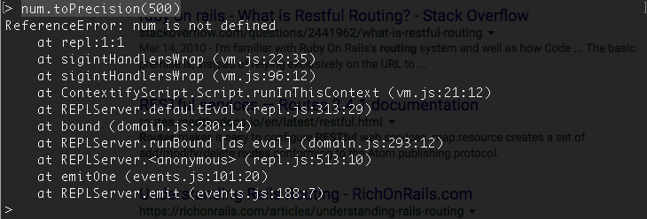
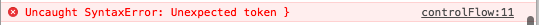

# Errors and Debugging

1. 5 min Intro & Objectives
1. 20 min TT Demo of Solution to Giphy Tutorial
1. 20 min TT and Demo on Errors
1. 30 min Challenges
1. 5 min Wrap up

## Objectives

1. Read and interpret errors
1. Google errors to understand them
1. Use errors to find out your next step

## Errors are Your Friends

Errors generally will tell you what is wrong with your code. Take the time to read them carefully and use them to solve your problems rapidly.

JavaScript errors you will see in two places. In your terminal (server errors) and in your console (client errors). In either case, errors have the same parts. An error type ("ReferenceError"), a specific error message ("num is not defined"), and then a **Stack Trace**.



The **Stack Trace** is the last commands the computer ran in reverse chronological error. Most of these commands happen on code you did not write and therefore cannot debug. However, usually the one line of code in the stack trace that you DID write is the one you need to fix.

When you want to Google an error, google the error type and the error message statement. e.g. `ReferenceError: num is not defined`.

### Types of JavaScript errors:

1. **RangeError** - A number "out of range" has occurred - 99% of the time you did math wrong.
1. **ReferenceError** - An illegal reference has occurred - 99% of the time you forgot to define a variable and then called something on it.
1. **SyntaxError** - A syntax error has occurred - 99% of the time you forgot a `,`, `}`, or a `)`.
1. **TypeError** - A type error has occurred - 99% of the time you called a function on the wrong type. e.g. `num.toUpperCase();` when `num` is an integer and `toUpperCase()` is a string function.
1. **URIError** - An error in encodeURI() has occurred - 99% of the time you screwed up the format of a URL or request.

## Resources

1. [Three Options to Debug Node](https://spin.atomicobject.com/2015/09/25/debug-node-js/)
1. [Node's Debugger](https://nodejs.org/api/debugger.html)
1. [node-inspector](https://github.com/node-inspector/node-inspector)
1. [Node Inspector (video)](https://www.youtube.com/watch?v=03qGA-GJXjI)
1. [Node.js's Errors](https://nodejs.org/api/errors.html#errors_class_referenceerror)

## Baseline Challenges

1. Use `console.log()` to debug the Giphy API tutorial's main route. Print out the `req` and Giphy API `response` objects.
1. Use Node's native debugger to do the same thing.
1. Now use `node-inspector` to do the same thing.

1. Run these snippets of JS in your Node REPL (type `node` in your bash terminal) and in your Chrome Console tab. Examine errors and see what you would have to do to fix them (so they did not throw an error).

	```js
	// 1
	num.toPrecision(500)

	//2
	var x;
	x = y + 1;

	//4
	num.toUpperCase();

	//3
	var person;
	person.height;

	//5
	var person;
	person.eatsASandwhich();
	
	// Run this lastt one in your browser's console
	//6 
	eval("alert('Hello)");
	```

1. Read the following code snippet. What should it do? Can you run it in your console in your browser? What error do you get? Can you fix it?

	```js
	var peoplesNames = ["Dan", "Kathy", "Monika", "Carl"]

	var shortNames = [];
	var longNames = [];
	for (i = 0; i < peoplesNames.length; i++) {
	    if (peoplesNames[i].length < 4) {
		shortNames.push(peoplesNames[i])
	    } else
		longNames.push(peoplesNames[i])
	    }
	}
	console.log(shortNames);
	console.log(longNames);
	```


