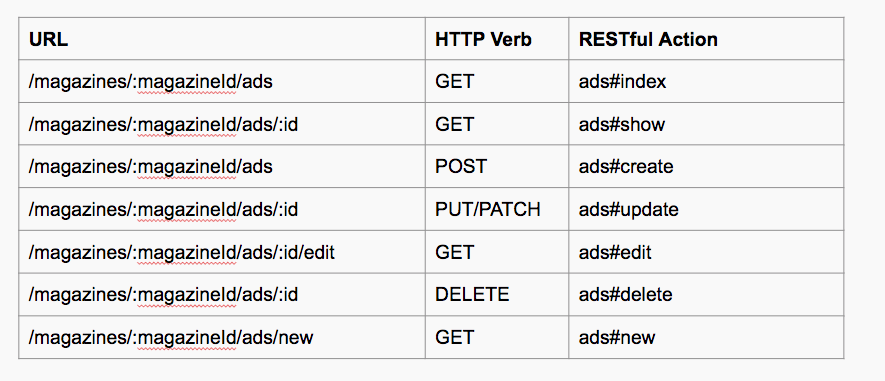

# Resourceful Routing

## Objectives

1. Identify and use RESTful and Resourceful routes
1. Identify and use nested routes for nested resources
1. Read and interpret errors to find out your next step (google them!)
1. Use the native JavaScript `debugger` function

## Giphy Feedback Tips

- Indentation, Indentation, Indentation
- Breaking with no search term
- Commenting out unused code
- Git init inside of project directory
- Not following convention (rare)

## Routing

A route is a url, a web endpoint, a path, or you might just call it a link. Routes are just strings, they can look like anything at all. But we want to follow standard conventions. So we use RESTful and Resourceful routes.


**Please memorize these routes.**

Nested Routes



### REST in Express.js

Express.js is built to accommodate a RESTful and Resourceful routes.

```js
var express = require('express');
var app = express();

// INDEX
app.get('/posts', (req, res) => {

});

// SHOW
app.get('/posts/:id', (req, res) => {

});

// NEW
app.get('/posts/new', function(req, res){

});

// CREATE
app.post('/posts', function(req, res){

});

// EDIT
app.get('/posts/:id/edit', function(req, res){

});

// UPDATE
app.put('/posts/:id', function(req, res){

});

// DESTROY
app.delete('/posts/:id', function(req, res){

});

app.listen(3000);
```

## Activity: Predicting and Generating Resourceful Routes - 20 min

1. Work with a partner to define what these routes expect and return:
    - PUT `/articles/:articleId`
    - GET `/users/:userId/articles/:id`
    - POST `/classes/:classId/students`
    - GET `/classes/:classId/students`
    - GET `/epoch/:eraId/dinosaurs`
1. Work with a partner to define what the route would be for the following resources:
    - All the classes
    - All a users comments
    - A single article by an author
		- the menu items from one restaurant
		- Give me the form to make a new fish
    - create a new fish
		- Update a fish
    - The details of one hotel
    - All guests going to an event
		- Delete a fish
1. Come up with 3 or more routes that do not follow the Resourceful pattern, but sites still commonly use. (hint: "/about-us")

## Break 10 min

## Errors = Sign Posts

Errors generally will tell you what is wrong with your code. Take the time to read them carefully and use them to solve your problems rapidly.

JavaScript errors you will see in two places. In your terminal (server errors) and in your console (client errors). In either case, errors have the same parts. An error type ("ReferenceError"), a specific error message ("num is not defined"), and then a **Stack Trace**.


The **Stack Trace** is the last commands the computer ran in reverse chronological error. Most of these commands happen on code you did not write and therefore cannot debug. However, usually the one line of code in the stack trace that you DID write is the one you need to fix.

When you want to Google an error, google the error type and the error message statement. e.g. `ReferenceError: num is not defined`.

### Types of JavaScript errors:

1. **RangeError** - A number "out of range" has occurred - 99% of the time you did math wrong.
1. **ReferenceError** - An illegal reference has occurred - 99% of the time you forgot to define a variable and then called something on it.
1. **SyntaxError** - A syntax error has occurred - 99% of the time you forgot a `,`, `}`, or a `)`.
1. **TypeError** - A type error has occurred - 99% of the time you called a function on the wrong type. e.g. `num.toUpperCase();` when `num` is an integer and `toUpperCase()` is a string function.
1. **URIError** - An error in encodeURI() has occurred - 99% of the time you screwed up the format of a URL or request.

## Demo: Starting Rotten Potatoes - 20 min

- User-Centered Development
- Errors
- `eval(require('locus'))`
- console.log()

## Resources

1. [restful_routes.md - github version of RESTful routes image](https://gist.github.com/alexpchin/09939db6f81d654af06b)
1. [Three Options to Debug Node](https://spin.atomicobject.com/2015/09/25/debug-node-js/)
1. [Node's Debugger](https://nodejs.org/api/debugger.html)
1. [Locus](https://www.npmjs.com/package/locus)
1. [node-inspector](https://github.com/node-inspector/node-inspector)
1. [Node Inspector (video)](https://www.youtube.com/watch?v=03qGA-GJXjI)
1. [Node.js's Errors](https://nodejs.org/api/errors.html#errors_class_referenceerror)
