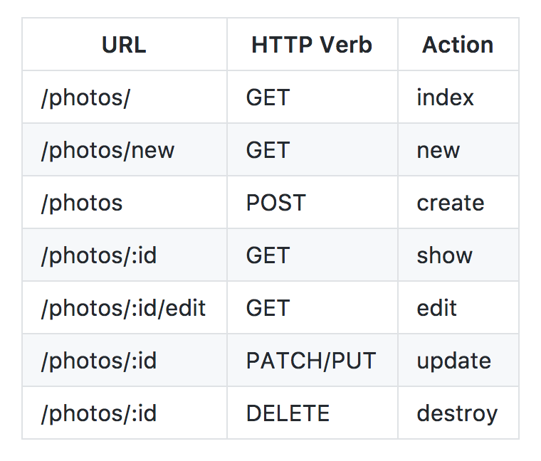

# RESTful & Resourceful Routing

1. 5 min Intro & Objectives
1. 10 min TT on RESTful and Resourceful Routing
1. 30 min Challenges
1. 10 min Break
1. 15 min Kick off Rotten Tomatoes App
1. 5 min Wrap up

## Objectives

1. Identify and use RESTful and Resourceful routes
1. Identify and use nested routes for nested resources

## Routing

A route is a url, a web endpoint, a path, or you might just call it a link. Routes are just strings, they can look like anything at all. But we want to follow standard conventions. So we use RESTful and Resourceful routes.



Please memorize these routes.

### REST in Express.js

Express.js is built to accomodate a RESTful and Resourceful routes.

```js
var express = require('express');
var app = express();

// INDEX
app.get('/posts', function(req, res){

});

// SHOW
app.get('/posts/:id', function(req, res){

});

// NEW
app.get('/posts/new', function(req, res){

});

// CREATE
app.post('/posts', function(req, res){

});

// EDIT
app.get('/posts/:id/edit', function(req, res){

});

// UPDATE
app.put('/posts/:id', function(req, res){

});

// DESTROY
app.delete('/posts/:id', function(req, res){

});

app.listen(3000);
```

## Resources

1. [restful_routes.md - github version of RESTful routes image](https://gist.github.com/alexpchin/09939db6f81d654af06b)

## Baseline Challenges

1. Read this Rails documentation on [routing for **Nested Resources**](http://guides.rubyonrails.org/routing.html#nested-resources).
    - What are three examples of using nested routes?
    - Could you make nested routes with Express as well?
1. Work with a partner to define what these routes expect and return:
    - PUT `/articles/:articleId`
    - GET `/users/:userId/articles/:articleId`
    - POST `/classes/:classId/students`
    - GET `/classes/:classId/students`
    - GET `/epoch/:eraId/dinosaurs`
1. Work with a partner to define what the route would be for the following resources:
    - show me all the classes
    - show me all a users comments
    - show a single article by an author
    - show all the fish alive in the pliocene epoch
    - create a new fish
    - see the edit form to edit a fish for lake Winibego
    - update a fish record for lake Winibego.
1. Find a partner and begin the [Rotten Potatoes Project](https://www.makeschool.com/online-courses/tutorials/rotten-potatoes-movie-reviews-with-express-js/bootstrap-an-express-project).
