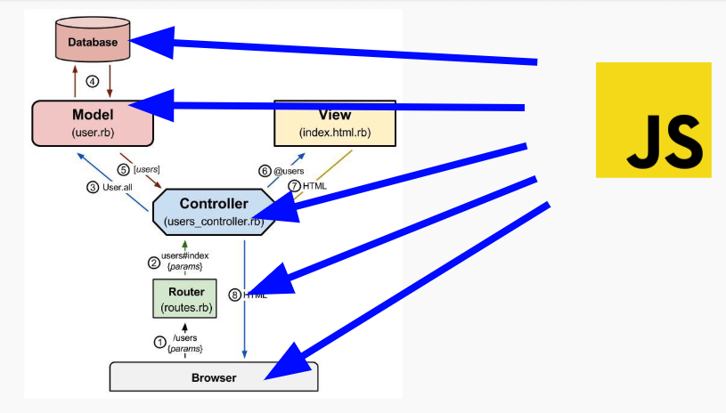

# Document-based Databases

## Objectives

1. Identify the key characteristics of a NoSQL or Document-based database
1. List the pros and cons of a Document-base database
1. Navigate the most simple commands inside the mongo shell
1. Use Mongoose’s simplest Query Helpers to query a Document-based database.

## Document-based Databases or NoSQL

Why use a Document-Based Database?

Full Stack JavaScript!



```js
// JS OBJECT
{
  title: "Great Project"
}
```

```js
// JSON OBJECT
{
  "title": "Great Project"
}
```
```js
// MONGODB OBJECT
{
  _id: "507f1f77bcf86cd799439011",
  title: "A New Project"
}
```

A MongoDB database allows you to save JavaScript Objects or JSON just as they are as **key value pairs**. In a MongoDB each object is called a single **document**, hence why this sort of database is called a **document-based database**. These documents are collected into groups called **collections**. So we will save our project documents in a collection called "projects".

MongoDB gives each document a unique identification number with the key **_id** (with an underscore). We'll use that **_id** attribute to retrieve the whole document later. MongoDB is sorta like dropping clothes off at the drycleaners. They put a number on each piece of clothing and give you a ticket for each one. Later we can get that clothing back by matching our ticket to the right number.

So if we saved a new project like this to a MongoDB database:

```js
// JS OBJECT
{
  title: "A New Project"
}
```

Then it will save something like this:

```js
// MONGODB OBJECT
{
  _id: "507f1f77bcf86cd799439011",
  title: "A New Project"
}
```

Documents are grouped into **Collections**. And these collections should have the same name as your resources. So a `User` resource should have a `users` collection. And an `Article` resource should have an `articles` collection.


### Pros

1. Writes fast
1. No migrations - more flexible and easy to start
1. "Schemaless" - can write anything you like

### Cons

1. Slow to traverse
1. Slow to read
1. No migrations - no timeline of updates to database structure
1. "Schemaless" - can be too unstructured

## Resources

1. [Mongo Shell Quick Reference](https://docs.mongodb.com/manual/reference/mongo-shell/)

## Mongo Shell Challenges

1. Open the mongo shell in your terminal.
1. Query what databases you have.
1. Create a database called `my-blog`.
1. Insert an article in a new articles collection with the attributes `title` and `body`.
1. Query for all articles.
1. Bulk insert 3 more articles.
1. Query for just one article.
1. Delete that article.
1. Download [Robo 3T](https://robomongo.org/) and look at the database you created with the mongo shell.

## 10 Minute Break


## ODM

Mongoose is a ODM (object document mapping) express middleware that makes it easier to interact with a MongoDB database. It lets you create and validate attributes and create model and instance methods and many other common OXM features.

Why use an ODM

* Data Types and Validations
* Advanced Querying - `.query()`, `.populate()`
* Timestamps (createdAt & updatedAt)
* Instance and Static functions
* Virtuals
* Converts BSON into JS Object
* Promises

### Model

To interact with the database, we use an abstraction called a **Model**. Like a resource, you can tell if something is a model because it is single and capitalized. For example:

* Article
* Pet
* Building
* City
* Trip

A model is like a prototype for an object because you can assign it attributes and define static and instance methods for it. You can also set validations on a model's attributes.

```js
var mongoose = require('mongoose');
var Schema = mongoose.Schema;

var postSchema = new Schema({
  title:  String,
  author: String,
  body:   String,
  comments: [{ body: String, date: Date }],
  date: { type: Date, default: Date.now },
  hidden: Boolean,
  meta: {
    votes: Number,
    favs:  Number
  }
});

var Post = mongoose.model('Post', postSchema);

module.exports = Post;
```

## Common Queries and Helpers

The most common queries are just finding many or one document.

* `.find()`
* `.findById(authorId)`
* `.findOne({ email: email })`

Mongoose provides more helpers that let you order, group, exclude and include documents.

```js
// With a JSON doc
Person.
  find({
    occupation: /host/,
    'name.last': 'Ghost',
    age: { $gt: 17, $lt: 66 },
    likes: { $in: ['vaporizing', 'talking'] }
  }).
  limit(10).
  sort({ occupation: -1 }).
  select({ name: 1, occupation: 1 }).
  exec(callback);

// Using query builder
Person.
  find({ occupation: /host/ }).
  where('name.last').equals('Ghost').
  where('age').gt(17).lt(66).
  where('likes').in(['vaporizing', 'talking']).
  limit(10).
  sort('-occupation').
  select('name occupation').
  exec(callback);
```

As a one-liner:

```js
Tank.find({ size: 'small' }).where('createdDate').gt(oneYearAgo).exec(callback);
```

## Activity #1: Write these queries in JavaScript using mongoose syntax

Write the queries using mongoose syntax https://mongoosejs.com/docs/api.html

1. Find all users
1. Find one article by its id
1. Find one user by their social security number
1. Find the first three Reviews with 5 stars
1. Find the 10 oldest articles to be created
1. Find all users over 80 years old
1. Find all books with “Harry Potter” in the title. Sort them alphabetically by title.
1. Find all products whose price is over 100 dollars.

## Activity #2: Find what each of these return? (Hint: use mongoose docs)

```js
Person.find().sort({age: 1}).limit(100).then(err, people => {});

Event.findOne({ name: "Lightening Party" }).then(err, event => {});

Car.findById(req.params.carId).then(err, car => {});

Company.findOne({ _id: req.params.companyId }).then(err, company => {});

Monster.find({ type: "crawly" }).limit(10).sort({ferocity: 1}).then(err, monster => {});

User.find({ age: {$gt: 18, $lt: 65 }}).then(err, users => {});

User.find({likes: {$in: ['chatting', 'candle making']}}).then(err, users => {});
```
