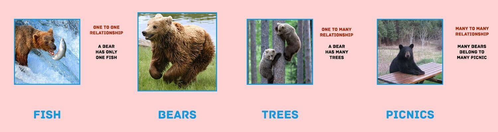

# MongoDB Associations & Queries

## Objectives

1. Master drawing a simple Entity Relationship Diagrams (ERDs) (2-5 resources)
1. Utilize the common verbiage for defining **Resource Associations**
1. Gain familiarity with Mongoose queries for associated resources, including the function `.populate()`

## ERD Bears

Consider three resources: Fishes, Bears, Trees, and Picnics



1. Bears have many trees, trees belong to one bear
2. Bears have one fish, fish belongs to one bear
3. Bears have and belong to many picnics

## Associations (10 min)

There are three sorts of resource associations:

1. **One-to-Many** or Has Many/Belongs To
1. **One-to-One** or Has One/Belongs To
1. **Many-to-Many** or Has And Belongs to Many, or Has Many Through

```
One to many in Facebook:

Users have many Posts
Users have many Comments
Users have many Likes
```

```
Has and Belongs to Many in Eventbright

Users have many Events as reservations
Users belong to many Events as guests
```

```
Has One/Belongs To (Rare)

User has one Profile
User has one Credit Card
```

## Entity Relationship Diagrams—ERDs (5 min)

Before you code a project, it is good to spend about an hour completing three deliverables:

1. User Journeys (UX)
1. Wireframes (UI)
1. An Entity Relationship Diagram (Architecture)

These three will give you an baseline idea of the structure of your project before beginning. And they only take a few minutes to complete.

Let's look at how to draw ERD's.

Connect resources in boxes with arrows depending on their relationship:

1. Many-to-One "=>"
1. Many-to-Many  "<=>"
1. One-to-Many "-->"


## Activity - Drawing ERDs (15 min)

Draw ERDs for the core features of 3 the following applications. You can pick your own products if you like to draw. When you finish your first, check with a partner. Form into groups of 4 and show your favorites off.

1. Lyft
1. Pinterest
1. Airbnb
1. Facebook
1. The AppStore

## Modeling these Associations in MongoDB (20 min)

In a document-based database these **Resource Associations** are modeled in a few ways. Here they are ordered by frequency

1. Reference Documents (very common)
1. Value Associations (pretty common)
1. Embedded Documents (very rare)

### Reference Documents (very common)

Very common for one-to-many and many-to-many associations.

```js
// USER HAS MANY POSTS
{
  "name": "John Brown",
  "posts": ["a41492308329r900sdf", "9309safd0as0f9f098af"]
}

// POST BELONGS TO USER (AS AUTHOR)
{
  "title": "John Brown",
  "author": "asf675as6f6a4s6f"
}

// GIVE ME A USER AND ALL THEIR POSTS
User.findById(userId).populate('posts').then(...).catch(...);

// GIVE ME ALL POSTS BY ONE USER
Post.find({author: userId}).then(...).catch(...);
```

Implementation:

```js
const UserSchema = new Schema({
    , name      : { type: String, required: true }

    , rsvps     : [{ type: Schema.Types.ObjectId, ref: 'Event' }]
});

const EventSchema = new Schema({
    , title      : { type: String, required: true }
    , desc       : { type: String, required: true }

    , guests     : [{ type: Schema.Types.ObjectId, ref: 'User' }]
});
```

### Value Association (pretty common)

```js
// Post belongs to Subreddit
{
  "title": "",
  "subreddit": "Jugglers Anonymous"
}

// GIVE ME ALL POSTS IN ONE SUBREDDIT
Post.find({subreddit: "Jugglers Anonymous"}).then(...).catch(...);

// User belongs to City
{
  "name": "John Brown",
  "city": "San Francisco"
}

// GIVE ME ALL USERS IN ONE CITY
User.find({city: "San Francisco"}).then(...).catch(...);
```

Implementation:

```js
const mongoose = require('mongoose'),
      Schema = mongoose.Schema;

const RestaurantSchema = new Schema({
    , name       : { type: String, required: true }
    , category   : String
    , tags       : [String]

    , owner      : { type: Schema.Types.ObjectId, ref: 'User', required: true }
},{
    timestamps: true
});

module.exports = mongoose.model('Review', ReviewSchema);
```

### Embedded Documents (very rare)

Rare for one-to-many associations. Only use when you always want all children to appear with the parent. Also if you don't want to edit the children very much or at all.

```js
// Comments belong to Post
{
  "title": "Awesome Article",
  "comments": [
    { "content": "What a great article" },
    { "content": "Agreed!" }
  ]
}
```

Implementation:

```js
const CommentSchema = new Schema({ title: String, content: String });

const ArticleSchema = new Schema({
    , title      : { type: String, required: true }
    , content    : { type: String, required: true }

    , author     : { type: Schema.Types.ObjectId, ref: 'User', required: true }
    , comments   : [CommentSchema]
},{
    timestamps: true
});
```

## Activity: Code Review (15 min)

Pair up and review each other's Rotten Potatoes.

Review code for:

1. Completeness
1. Variable naming
1. Spacing and Indentation
1. Modularity and file structure
1. Usability and style
