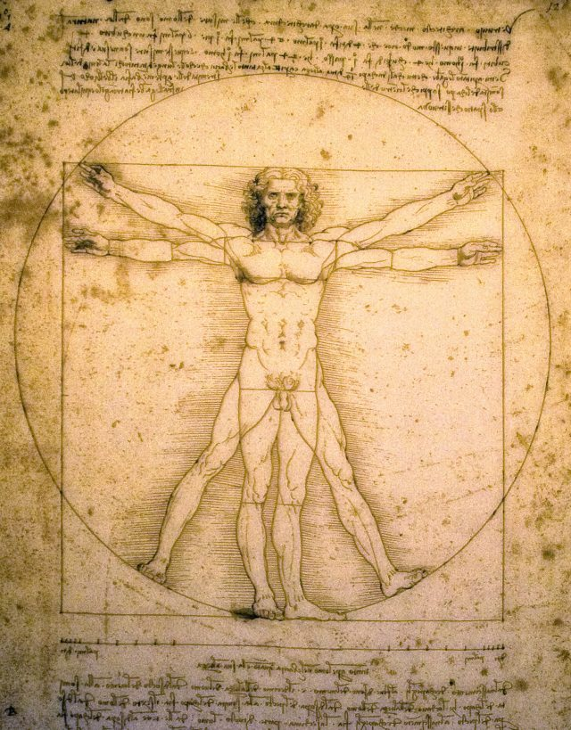
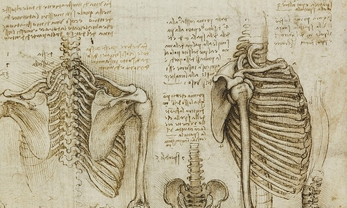

# The DOM, HTML, CSS, JS Events and Listeners

## Objectives

1. List the major characteristics of the Renaissance
1. Define a **polymath** or **multipotentialite**
1. Define the DOM and explain its structure
1. Manipulate the DOM with JS
1. Style the DOM with CSS

## Warm Up Activity: I Do, You Do - Wireframing (15 min)

Go to the whiteboard and draw a wireframe for three screens of one of the following apps or one you decide on:

1. Linkedin (Website)
1. Spotify (App)
1. Podcasts (App)
1. Gmail (Website)

## Overview: Leonardo Da Vinci & the Renaissance (25 min)


Leonardo Da Vinci was a Renaissance **polymath** and **multipotentialite**—that is, someone who cultivates many skills and becomes an expert in many bodies of knowledge. He made significant contributions to invention, painting, sculpting, architecture, science, music, mathematics, engineering, literature, anatomy, geology, astronomy, botany, writing, history, and cartography. He designed a prototype of the first helicopter, painted the Mona Lisa, and made strides in anatomy.

Italy did not exist when he lived, but he lived in what are now Italian cities, Florence, Milan, Rome, Bologna, Venice, and lived the final years of his life in France.

**The Renaissance** - 14-17th centuries, characterized by the rise of humanism and the adoration of classical Greek and Roman culture. Caused by the reemergence of trade, the Crusades, demographic changes from the Black Plague, and cultural conditions of Florence.

**Renaissance People**
* Donatello - ??? 1386 – 13 December 1466
* Leonardo Da Vinci - 15 April 1452 – 2 May 1519
* Michelangelo - 6 March 1475 – 18 February 1564
* Raphael - April 6 1483 – April 6, 1520
* Machiavelli - 3 May 1469 – 21 June 1527
* Shakespeare - 26 April 1564 – 23 April 1616

## Overview: An Analogy for the DOM—The Body (10 min)

The DOM is like a body.

* The HTML is like the **Bones** - it provides a ridged structure.
* The JavaScript is like the **Muscles, Nerves, and Brain** - it lets the body remember things and move.
* The CSS is like the **Clothes** - It makes the body look stylish.



> The Vitruvian Man - "The proportions of the human body according to Vitruvius"

## HTML



Each webpage is made up of a tree-like structure of HTML called the **DOM (Document Object Map)**.

So this snippet of HTML has the tree-like DOM structure in the image below.

```HTML
<html>
  <head>
    <title>My Title</title>
  </head>

  <body>
    <a href="#">My Link</a>
    <h1>My header</h1>
  </body>
</html>
```


## JavaScript


JavaScript we've been using so far on the server side, but it actually was invented for the browser.

JavaScript is like the muscles and ligaments of the body because it makes the DOM **Dynamic** by being able to:

* Move the DOM around
* Add or remove parts of the DOM
* Send requests to API's
* Store things in LocalStorage, Cookies, and SessionStorage
* Change the way things look by updating the styles of the DOM

### Selectors, Listeners, and Events

JavaScript can manipulate the DOM and interact with users through placing various **Listeners** that listen for **Events** such as `click`, `mouseOver` and `submit`. In order to set a listener, you have to use **Selectors**.

Selectors can be:

```HTML
<!-- id (common) -->
<h1 id="title"></h1>
<script>
let titleHeader = document.querySelector('#title');
titleHeader.innerHTML = "A New Title";
</script>

<!-- class (only for many) -->
<ul id="marx-brothers">
    <li class="marx-brother">Groucho</li>
    <li class="marx-brother">Harpo</li>
    <li class="marx-brother">Chico</li>
</ul>
<script>
let marxBrothersArr = document.querySelector('.marx-brother');
marxBrothersArr.parentNode.appendChild("<li class='marx-brother'>Zeppo</li>");
</script>

<!-- tag (rare) -->
<p></p>
<script>
let paragraphs = document.querySelector('p');
paragraphs.innerHTML = "There is no greatness where there is not simplicity, goodness, and truth."
</script>
```

Once you set a listener, when the event occurs, the code will run.

```html
<a href="#" id="alert-me">Tell of the Ruling Yahoo</a>

<script>
document.getElementById('alert-me').addEventListener('click', function () {
    alert('He had heard, indeed, some curious Houyhnhnms observe, that in most herds there was a sort of ruling Yahoo');
    return false
});
</script>
```

## CSS

**Cascading Style Sheets** are the clothes of the DOM. They make the HTML look good. Like their name they *cascade* over the DOM updating each part.


### Selectors and Syntax

You can do **inline styling** but it is not a very DRY pattern, so people invented CSS.

```HTML
<!-- INLINE STYLING -->
<blockquote style="margin:0 10px 0 0">Because of the self-confidence with which he had spoken, no one could tell whether what he said was very clever or very stupid. - <i>War and Peace</i> by Leo Tolstoy<blockquote>
```

CSS also uses the same **DOM Selectors** as JavaScript. Each block of CSS has the same three parts: **selector**, **attributes**, and **values**.

```css
/*
.selector {
    attribute: value;
}
*/

/* class selector (common) */
.comment {
    color: red;
}

/* id selector (rare) */
#title {
    font-size: 38px;
}

/* tag selector (rare) */
p {
    margin-left: 10px;
}
```

You should be able to use just the **class** selector for 90% of all css. But there are many advanced selectors you can look at here: [Advanced CSS Selectors](https://www.w3schools.com/cssref/css_selectors.asp)

## CSS/DOM Activity: Hacking MakeSchool.com (20 min)

Go to makeschool.com (or any another website) and open your developer tools. From there, begin changing and removing and adding CSS until you've made the Make School in your own image :D.

Can you...

1. Change the colors
1. Change the images
1. Change the fonts
1. Change the text

Take a screenshot when you are done and share on slack in the #random channel for all to see :D

## Onward!

Continue to work on Rotten Potatoes I & II or Contractor Project
