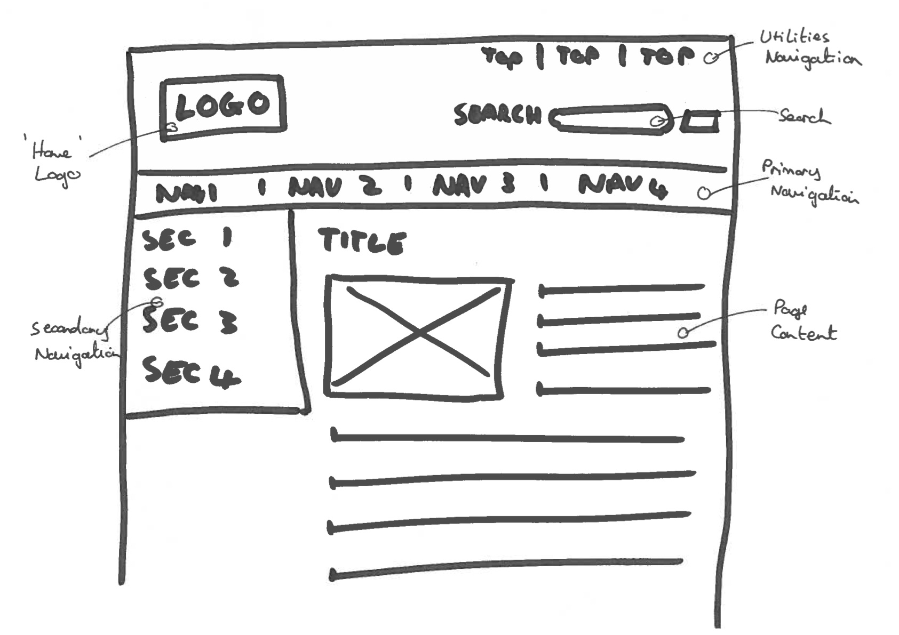
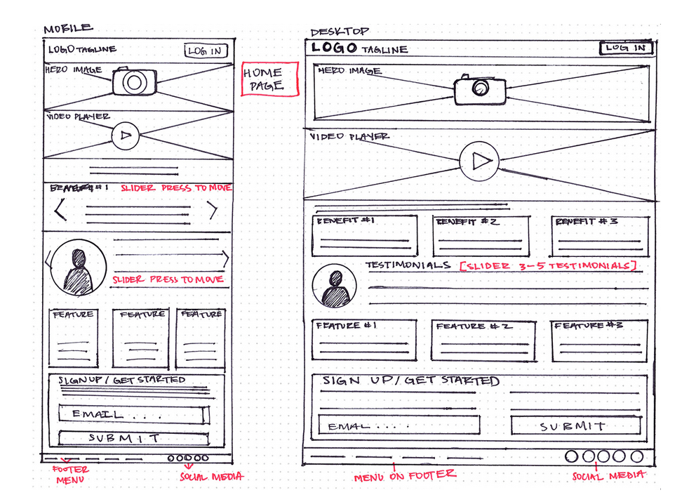
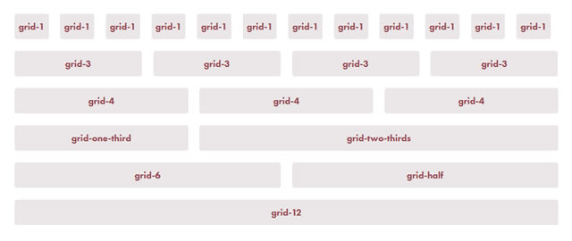

# Bootstrap Basics

1. 5 min Intro & Objectives
1. 30 min Initial activity
1. 20 min TT and Demo on CoC and Bootstrap
1. 10 min Break
1. 30 min Challenges
1. 5 min Wrap up

## Objectives

1. Add bootstrap to any project.
1. Utilize bootstraps most basic css classes to define a conventional web design
1. Deploying a bootstrap responsive grid, navbar, and footer

## Initial Activity

Pick three of the websites you use the most. Now draw wireframes on a sheet of paper for one page of each one. Here are two examples of some simple drawn wireframe. Do you notice any common themes between the three pages? What are common visual elements or modules that all the pages have?

**Not detailed enough**


**Good detail**


**Good detail**


## Overview

Remember that Convention over Configuration is a way to gain in development speed, code reusability, and to cope with unexpected edge cases. Well we can use CoC on the front end as well as the back end. We will first be learning how to use Bootstrap to learn the conventions of web design, and then in future classes we will learn how to write completely custom CSS code. For now though, we just need things to look OK.

Much like Picasso who first mastered the traditional painting techniques before launching off to invent modern art.

### Early Picasso


### Late Picasso


### Defining a Layout with the Responsive Grid

The grid is the most basic and most important concept and use of bootstrap. Using margins, floats, and percentage widths, bootstrap and pretty much all CSS frameworks define a grid, usually with 12 columns.



The grid can be applied to any element so every cell of the grid is its own 12 column grid.

Here is an example of a standard bootstrap grid inside a `container` element (which adds padding to the sides of the page)

```html
<div class="container">
  <div class="row">
    <div class="col-sm-10 col-sm-offset-1">
    </div>
  </div>
</div>
```

The `sm`, `lg`, `xs`, etc in the defining the column classes lets you know that this is a **Responsive Grid**. These prefixes let you know what size screen these classes will respect.

* `xs` - mobile
* `sm` - tablet
* `md` - laptop
* `lg` - desktop
* `xlg` - large desktop

If you wanted certain elements to have a width of 1/3 of an element on a mobile phone in portrait mode you would use the `col-xs-4` class. You can use these classes together to make your projects look good on any sized screen.

Underneath the hood these classe are using the CSS3 `@media` [**media queries**](https://www.w3schools.com/css/css_rwd_mediaqueries.asp).

You can also use other various **helper classes** to control what your site looks like on various screen sizes. `xs-hidden`, `sm-visible`, etc all will do what they say, e.g. `xs-hidden` will hide the element on a mobile phone.

## Resources

1. [Bootstrap](http://getbootstrap.com/)
1. [Boostrap (videos by Quentin Watt)](https://www.youtube.com/playlist?list=PL41lfR-6DnOovY0t3nBg8Zb6aqm_H70mR)

## Baseline Challenges

1. Add bootstrap to your project using the [CDN link](http://getbootstrap.com/getting-started/#download-cdn).
1. Add the [default bootstrap navbar](http://getbootstrap.com/components/#navbar-default) to your layout template.
1. Use the [responsive grid classes](http://getbootstrap.com/css/#grid) to add a responsive layout to your layout template and each template of your project. Remember you might need to use the [responsive utilities](http://getbootstrap.com/css/#responsive-utilities) helper classes.
1. Make sure your project is fully mobile responsive using the [chrome device emulator](https://www.youtube.com/watch?v=da_ACsJT8l8).
1. Add the bootstrap [form/input helper classes](http://getbootstrap.com/css/#forms) to make your forms pretty.
1. Add bootstrap [button classes](http://getbootstrap.com/css/#buttons) to your buttons.
1. Use some of bootstrap's [typographic classes](http://getbootstrap.com/css/#type) and [helper classes](http://getbootstrap.com/css/#helper-classes) to complete your project.

## Stretch Challenges

1. Pick out another bootstrap component and add it to your Rotten Potatoes project.
1. Pick out a bootstrap JavaScript component and add it to your Rotten Potatoes.
