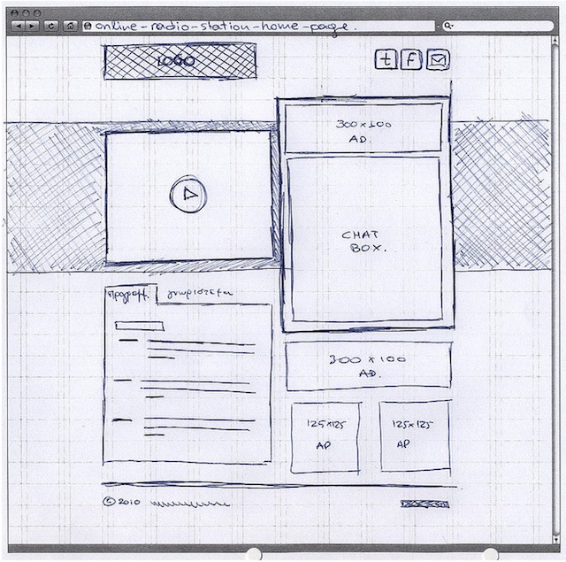
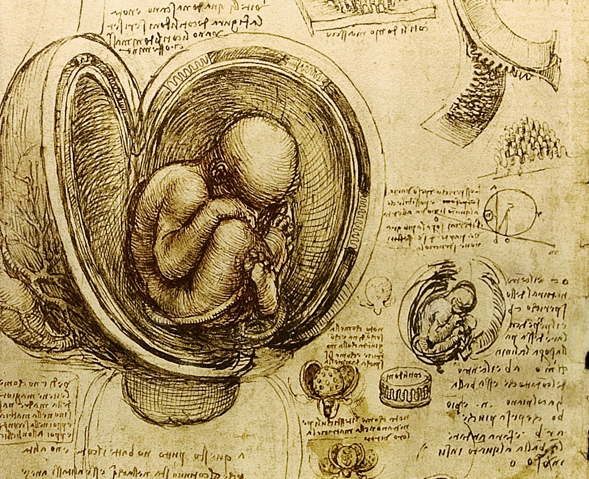
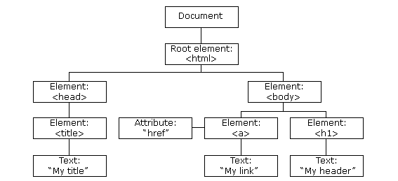

# The DOM & Intro to Bootstrap

## Initial Activity: Detecting Conventions with Wireframing (10 min)

Like Leonardo Da Vinci, you are going to draw what your products will look like:


Pick a new website. Now draw wireframes on a sheet of paper for one page of each one. Here are two examples of some simple drawn wireframe. Do you notice any common themes between the three pages? What are common visual elements or modules that all the pages have?

**Not detailed enough**


**Good detail**


**Good detail**


## Objectives (5 min)

1. List the major characteristics of the Renaissance.
1. Define the DOM, list its parts, and describe its hierarchical structure
1. Manipulate the DOM with JS
1. Style the DOM with CSS
1. Add bootstrap to any project
1. Utilize bootstraps most basic css classes to define a conventional web design
1. Deploying a bootstrap responsive grid, navbar, and forms.

## The Renaissance (1300-1600's in Europe) - Major Characteristics

**Leonardo Da Vinci** was a Renaissance **polymath** and **multipotentialite**—that is, someone who cultivates many skills and becomes an expert in many bodies of knowledge. He made significant contributions to invention, painting, sculpting, architecture, science, music, mathematics, engineering, literature, anatomy, geology, astronomy, botany, writing, history, and cartography. He designed a prototype of the first helicopter, painted the Mona Lisa, and made strides in anatomy.

Italy did not exist when he lived, but he lived in what are now Italian cities, Florence, Milan, Rome, Bologna, Venice, and lived the final years of his life in France (which did exist at that time).

#### The Causes of the Renaissance

1. The reemergence of trade around the Mediterranean and Europe
1. The Crusades
1. Demographic changes from the Black Plague
1. The cultural conditions of Florence

#### Renaissance People

1. Donatello - 1386 – 13 December 1466
1. Leonardo Da Vinci - 15 April 1452 – 2 May 1519
1. Michelangelo - 6 March 1475 – 18 February 1564
1. Raphael - April 6 1483 – April 6, 1520
1. Machiavelli - 3 May 1469 – 21 June 1527
1. Shakespeare - 26 April 1564 – 23 April 1616

#### The Renaissance Was Characterized

1. The rise of **Humanism**
1. Adoration of classical Greek and Roman culture
1. The beginnings of modern science
1. The beginnings of modern civil rights

<details><summary>What is Humanism?</summary>
<p>
The belief that humanity is the greatest good in the world. Greater even than God.


</p>
</details>

## Overview: An Analogy for the DOM—The Body (10 min)

The DOM is like a body.

* The HTML is like the **Bones** - it provides a ridged structure.
* The JavaScript is like the **Muscles, Nerves, and Brain** - it lets the body remember things and move.
* The CSS is like the **Clothes** - It makes the body look stylish.



## HTML


Each webpage is made up of a tree-like structure of HTML called the **DOM (Document Object Map)**.

So this snippet of HTML has the tree-like DOM structure in the image below.

```HTML
<html>
  <head>
    <title>My Title</title>
  </head>

  <body>
    <a href="#">My Link</a>
    <h1>My header</h1>
  </body>
</html>
```



## JavaScript


JavaScript we've been using so far on the server side, but it actually was invented for the browser.

JavaScript is like the muscles and ligaments of the body because it makes the DOM **Dynamic** by being able to:

* Move the DOM around
* Add or remove parts of the DOM
* Send requests to API's
* Store things in LocalStorage, Cookies, and SessionStorage
* Change the way things look by updating the styles of the DOM

### Selectors, Listeners, and Events

JavaScript can manipulate the DOM and interact with users through placing various **Listeners** that listen for **Events** such as `click`, `mouseOver` and `submit`. In order to set a listener, you have to use **Selectors**.

Selectors can be:

```HTML
<!-- id (common) -->
<h1 id="title"></h1>
<script>
let titleHeader = document.querySelector('#title');
titleHeader.innerHTML = "A New Title";
</script>

<!-- class (only for many) -->
<ul id="marx-brothers">
    <li class="marx-brother">Groucho</li>
    <li class="marx-brother">Harpo</li>
    <li class="marx-brother">Chico</li>
</ul>
<script>
let marxBrothersArr = document.querySelector('.marx-brother');
marxBrothersArr.parentNode.appendChild("<li class='marx-brother'>Zeppo</li>");
</script>

<!-- tag (rare) -->
<p></p>
<script>
let paragraphs = document.querySelector('p');
paragraphs.innerHTML = "There is no greatness where there is not simplicity, goodness, and truth."
</script>
```

Once you set a listener, when the event occurs, the code will run.

```html
<a href="#" id="alert-me">Tell of the Ruling Yahoo</a>

<script>
document.getElementById('alert-me').addEventListener('click', function () {
    alert('He had heard, indeed, some curious Houyhnhnms observe, that in most herds there was a sort of ruling Yahoo');
    return false
});
</script>
```

## CSS

**Cascading Style Sheets** are the clothes of the DOM. They make the HTML look good. Like their name they *cascade* over the DOM updating each part.


### Selectors and Syntax

You can do **inline styling** but it is not a very DRY pattern, so people invented CSS.

```HTML
<!-- INLINE STYLING -->
<blockquote style="margin:0 10px 0 0">Because of the self-confidence with which he had spoken, no one could tell whether what he said was very clever or very stupid. - <i>War and Peace</i> by Leo Tolstoy<blockquote>
```

CSS also uses the same **DOM Selectors** as JavaScript. Each block of CSS has the same three parts: **selector**, **attributes**, and **values**.

```css
/*
.selector {
    attribute: value;
}
*/

/* class selector (common) */
.comment {
    color: red;
}

/* id selector (rare) */
#title {
    font-size: 38px;
}

/* tag selector (rare) */
p {
    margin-left: 10px;
}
```

You should be able to use just the **class** selector for 90% of all css. But there are many advanced selectors you can look at here: [Advanced CSS Selectors](https://www.w3schools.com/cssref/css_selectors.asp)


## CSS/DOM Activity: Hacking MakeSchool.com (10 min)

Go to makeschool.com (or any another website) and open your developer tools. From there, begin changing and removing and adding CSS until you've made the Make School in your own image :D.

Can you...

1. Change the colors
1. Change the images
1. Change the fonts
1. Change the text

Take a screenshot when you are done and share on slack in the #random channel for all to see :D

## 10 Min Break

## Why Master Bootstrap? (5 min)

* Convention over Configuration
* Fast to Build
* Backend Web Developers expected to prototype
* "Design Systems" are popular everywhere, bootstrap is just a public & opensource one

## Bootstrap Overview (5 min)

Like Picasso you are going to master conventions before you break them.

Remember that Convention over Configuration is a way to gain in development speed, code reusability, and to cope with unexpected edge cases. Well we can use CoC on the front end as well as the back end. We will first be learning how to use Bootstrap to learn the conventions of web design, and then in future classes we will learn how to write completely custom CSS code. For now though, we just need things to look OK.

Much like Picasso who first mastered the traditional painting techniques before launching off to invent modern art.

### Early Picasso


### Late Picasso


## Demo of Bootstrap - Login Page (20 min)

### Defining a Layout with the Responsive Grid

The grid is the most basic and most important concept and use of bootstrap. Using margins, floats, and percentage widths, bootstrap and pretty much all CSS frameworks define a grid, usually with 12 columns.


The grid can be applied to any element so every cell of the grid is its own 12 column grid.

Here is an example of a standard bootstrap grid inside a `container` element (which adds padding to the sides of the page)

```html
<div class="container">
  <div class="row">
    <div class="col-sm-10 col-sm-offset-1">
    </div>
  </div>
</div>
```

The `sm`, `lg`, `xs`, etc in the defining the column classes lets you know that this is a **Responsive Grid**. These prefixes let you know what size screen these classes will respect.

* `xs` - mobile
* `sm` - tablet
* `md` - laptop
* `lg` - desktop
* `xlg` - large desktop

If you wanted certain elements to have a width of 1/3 of an element on a mobile phone in portrait mode you would use the `col-xs-4` class. You can use these classes together to make your projects look good on any sized screen.

Underneath the hood these classe are using the CSS3 `@media` [**media queries**](https://www.w3schools.com/css/css_rwd_mediaqueries.asp).

You can also use other various **helper classes** to control what your site looks like on various screen sizes. `xs-hidden`, `sm-visible`, etc all will do what they say, e.g. `xs-hidden` will hide the element on a mobile phone.

**Reminder** - the responsive grid will not work without this `<meta>` tag in your `<head>` element.

```HTML
<meta name="viewport" content="width=device-width, initial-scale=1">
```

## Navbar

Almost all websites have a navbar over the top of the page. Since it is so conventional. Bootstrap has a responsive navbar you can, and should, use in your projects.

[Bootstrap Navbar](https://getbootstrap.com/docs/4.1/components/navbar/)


## Forms

Bootstrap also provides very nice form and button styling.

[Bootstrap Forms](https://getbootstrap.com/docs/4.1/components/forms/)


```html
Copy
<form>
 <div class="form-group">
   <label for="exampleInputEmail1">Email address</label>
   <input type="email" class="form-control" id="exampleInputEmail1" aria-describedby="emailHelp" placeholder="Enter email">
   <small id="emailHelp" class="form-text text-muted">We'll never share your email with anyone else.</small>
 </div>
 <div class="form-group">
   <label for="exampleInputPassword1">Password</label>
   <input type="password" class="form-control" id="exampleInputPassword1" placeholder="Password">
 </div>
 <div class="form-group form-check">
   <input type="checkbox" class="form-check-input" id="exampleCheck1">
   <label class="form-check-label" for="exampleCheck1">Check me out</label>
 </div>
 <button type="submit" class="btn btn-primary">Submit</button>
</form>
```

## Activity: Recreating Your Wireframes (20 min)

Many great painters began their careers making deliberate copies of the masterworks of other artists. So we're going to take a chapter from their book.

1. Pick one of your wireframes you drew in the intial activity.
1. Make an `index.html` file in a new directory called `bootstrap-mockup`.
1. Now add bootstrap using the CDN link

    ```html
    <link rel="stylesheet" href="https://stackpath.bootstrapcdn.com/bootstrap/4.1.3/css/bootstrap.min.css" integrity="sha384-MCw98/SFnGE8fJT3GXwEOngsV7Zt27NXFoaoApmYm81iuXoPkFOJwJ8ERdknLPMO" crossorigin="anonymous">
    ```

1. Now using only bootstrap components make a static HTML/CSS prototype of your wireframe. Do not write any custom CSS, edit colors.
1. For any images, use [placeholder.com](https://placeholder.com/) images.

## Resources

1. [Bootstrap](http://getbootstrap.com/)
1. [Boostrap (videos by Quentin Watt)](https://www.youtube.com/playlist?list=PL41lfR-6DnOovY0t3nBg8Zb6aqm_H70mR)
