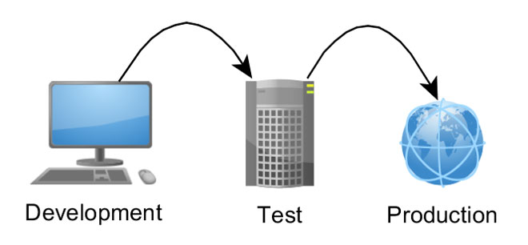
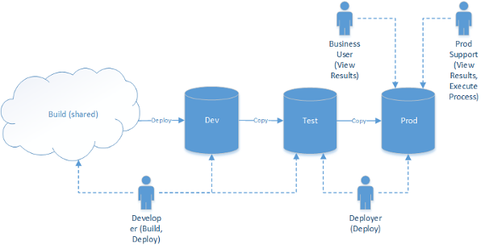

# Intro to RESTful APIs & Service Oriented Architecture

## Objectives (5 min)

1. Define what an API and RESTful API is
1. Define our routes to respond to JSON requests
1. Define an Environment strategy
1. Protect private keys using `dotenv`

## Take Pre Final Quiz (20 min)

## Activity - Explore Service Oriented Architecture (10 min)

With a partner pick 2 companies on [stackshare.io](https://stackshare.io/stacks) and examine the services and languages they use. Google the services you are not familiar with.

## Overview

### RESTful APIs

So far we've been making User Interfaces (UI's) by returning HTML templates to the client, but what if we want to let other applications use our web server, such as a mobile app client, a desktop client, a front end framework, or another web server? In that case we want to make an API.


An API is a set of web endpoints that respond to JSON (or XML) rather than with HTML templates. Basically, UI's are how people use your website, while API's are how other computers use your app.

We've already used APIs - like those found at [RapidAPI.com](rapidapi.com) - but now we want to make our own.

To make our server a RESTful API, we need our server to respond intelligently to JSON requests. Since we already have RESTful routes that return HTML, we have two options, either we can make separate whole controllers, or we can check if the request coming in has the `Content-Type` header of `application/json`, and then behave accordingly.

#### Same Controllers

```
controllers
  - posts.js
  - comments.js
```

#### Separate Controllers

```
controllers
  api
    - posts.js
    - comments.js
  - posts.js
  - comments.js
```

#### Versioned API

```
controllers
  api
    v1
      - posts.js
      - comments.js
    v2
      - posts.js
      - comments.js
  - posts.js
  - comments.js
```

#### Same Controllers - Respond to `application/json`

```js
app.get('/posts', function(req, res){

  ...

  //=> RETURN JSON
  if (req.header('Content-Type') == 'application/json') { return res.send({ post: post }); }

  //=> RETURN HTML
  return res.render('posts-show', { post: post }); //=> RENDER A TEMPLATE
});
```


#### New API controller routes

```js
// API ROUTES

// INDEX
app.get('/api/posts', function(req, res){

});

// SHOW
app.get('/api/posts/:id', function(req, res){

});

```

```js
// VERSIONED API ROUTES

// INDEX
app.get('/api/v1/posts', function(req, res){

});

// SHOW
app.get('/api/v1/posts/:id', function(req, res){

});

// ETC
```

> Notice that the NEW and EDIT routes are not necessary with a RESTful API.

## Activity: Make Rotten Potatoes Respond to JSON - 30 min

1. Download [Insomnia RESTful API Client](https://insomnia.rest/)
2. Use it to make a request to your "/" route. You should see the HTML that returns to any browser.
3. Now update your root route '/' logic to respond with JSON `reviews` if the `Content-Type` is `application/json`.
4. In your headers in insomnia add "Content-Type" "application/json" and make a request to '/'. You should see the JSON.
5. Now make the same change to the rest of your Review routes.

## The Production Environment

Any software project has at a few separate **Environments**. Currently we are just using 2 - DEV & PROD.

- **Development (DEV)** on local machines
- **Test (TEST)** on local machines or a separate test server
- **Staging (STAGING)** on a production server (private for stablization and load testing)
- **Production (PROD)** on a production server




Your computer is the host for your development environment.

Heroku will be the host we use for our Production environment. Heroku is a simple turn-key server solution that is free (but requires a credit card). Heroku also provides a rich marketplace of plugins to extend and enhance your server such as monitor bugs, speed, and add databases. We'll be using the "MongoLabs" plugin to add a production mongodb database to our project.

These environments can vary slightly.  Some differences between dev and prod will be what is in the database, or maybe the assets will be compiled, or a dozen other slight differences. As developers we try to keep these environments as similar to each other as possible because differences will make code that ran well in development break in production.


## Environment Variables in `process.env`

Sometimes you can't save everything into your code files because that would be insecure. For example, if you use a third party service like Amazon Web Services (AWS), then there will be sensitive keys that if you expose to the world on a public Github repo, hackers will steal them and use your codes to rack up hundreds of dollars in fees.

To secure such data, developers use encrypted environment variables that they store locally and in production.

The node package people use to define these variables is called [`dotenv`](https://www.npmjs.com/package/dotenv).

## Activity: Protect your Giphy API Key

1. Add `dotenv` to your giphy project
1. Add a `.env` file with the following file:

    ```
     GIPHY_API_KEY=yourapikeyvalue
    ```

1. If in development, load the `dotenv` moduel by putting this code at the top of your main server js file.

    ```js
    //server.js

    if (!process.env.PORT) { require('dotenv').config() }
    ...
    ```

1. Now your `process.env` in development will contain any variables you define in your `.env` file in the root of your project.

  ```js
    var apiKey = process.env.GIPHY_API_KEY
  ```

1. If you want this to work in production, you'll need to add a config variable in heroku.

    ```bash
    $ heroku config:set GIPHY_API_KEY=yourapikeyvalue
    ```
But to do this we'll need to first push giphy to heroku!

## Activity: Pushing Giphy (10 min)

1. Use `$ heroku create <<PROJECT NAME>>` to create a heroku project for your giphy search app.
1. Push your code to heroku and run `$ heroku open` to open your project. (It should be broken!)
1. Check the logs to see what is wrong `$ heroku logs`.
1. Point your server to listen to your dev and production port.

  ```js
  var port = process.env.PORT || '3000';
  server.listen(port);
  ```

1. Share the link to your giphy search in the BEW tracker.

## Homework: Getting Started with Heroku for Node.js (30 min)

1. Follow the instructions in this link [Get started with Heroku for Node](https://devcenter.heroku.com/articles/getting-started-with-nodejs#introduction)
1. Turn this link in the tracker.
