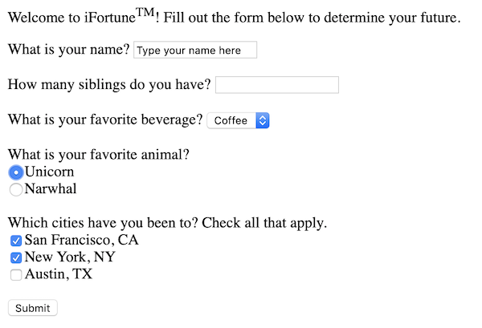

# BEW 1.1 Homework Assignments

Over the course of the 4 homework assignments, you will be making an application with 2 features: a "Fortune Teller" which gives a prediction based on user-entered data, and a weather app that tells you the weather in any given city.

## Homework 1

In your project directory, create a file called `fortune_form.html`. In it, create a form with **at least** 4 different kinds of form elements (e.g. text, number, radio button, drop-down, etc). These form elements should be asking the user various questions about themselves, which will be used to determine their fortune. (No need to actually do so now, though!)

Your form should have an `action` of `/fortune_results` and a `method` of `GET`.

You can open your HTML page in a new Chrome tab using "File -> Open". It now might look something like this:



In your project directory, create a file called `README.md` and in it, answer the following questions:

1. What happens when you press the "submit" button? Paste the full URL you are sent to on submit. 
1. What are the *keys* of this URL query string? How do they correspond to the "name" fields of your HTML form elements?
1. What are the *values* of the URL query string? How do they correspond to what the user entered or typed?

Stretch challenge question:

1. Is there a way to pass multiple values through the URL query string for a single key? How can we do so?

## Homework 2

In your project directory, create a folder called `templates` and move your `fortune_form.html` inside of it. 

Create two new empty files, `index.html` and `fortune_results.html`, inside of your templates directory.

In your project's root directory, create a file called `app.py` and give it the following contents:

```py
from flask import Flask, render_template

app = Flask(__name__)

@app.route('/')
def index():
    """Renders the home page with link to Fortune page."""
    return render_template('index.html')
```

Create a new route after the index route to display your fortune teller form (at the URL '/fortune').

Update `index.html` to link to your fortune page.

Now, create another route for the URL '/fortune_results'. In this route, create at least **four possible fortunes** based on the user's input from the form page. Display the user's fortune by passing it as a named parameter to the `fortune_results.html` template. Here is an example to get you started:

```py
@app.route('/fortune_results')
def fortune_results():
    """Displays the user's fortune."""
    users_favorite_animal = request.args.get('animal')
    # ... etc

    if users_favorite_animal == 'unicorn':
        # fortune is "You'll have a magical day!"
    elif condition2:
        # fortune is ...
    elif condition3:
        # fortune is ...
    else:
        # no other fortune applies, return default fortune
```

Feel free to get creative here!

At the end, your function should either call `render_template` and pass in the fortune as a named parameter (recommended) or return an HTML string containing the fortune. Make sure to test out your routes to make sure that all fortunes are working as intended.

Stretch challenges:

- Use the Python `random` library ([documentation](https://docs.python.org/3/library/random.html)) to introduce some randomness into your fortunes. For example, a user who likes cats might get either "Watch out for cattiness!" or "Have a purrfect day!" depending on their random result.
- Show the user a different image for each of your available fortunes.
- Render an entirely different HTML file depending on the fortune.
- Add styling to your page, and change the styling based on the fortune result. (Hint: Apply a different CSS class to your page elements depending on the fortune.)

## Homework 3

### Part 1: Explore the API

Step 1: Go to the [OpenWeatherMap sign-up page](https://openweathermap.org/appid) and sign up for an account. After signing up, click on the "API keys" tab and copy the API key. This is the key that you will use for making your queries.

Step 2: Open the [Postman](https://www.getpostman.com/downloads/) desktop client and enter the following URL:

```
http://api.openweathermap.org/data/2.5/weather?q=YOUR_CITY_HERE&appid=YOUR_APP_ID
```

Replace `YOUR_CITY_HERE` with the name of a city (e.g. `San+Francisco`), and replace `YOUR_APP_ID` with the API key you obtained in Step 1.

Step 3: Answer the following discussion questions in your homework's README file:

1. Describe the data contained in the API response. What can we discern about the weather in the specified city?

1. How would we obtain the temperature in the specified city? Describe using Python dictionary syntax. (HINT: Assume that the JSON response is stored in a variable called `json_response`.)


### Part 2: Display the temperature in a given city

We will be creating a page on our site to show the weather in any given city. When finished, it will look something like this:


In your templates directory, create a file called `weather_form.html`. Initialize it with the following contents:

```html
<form action="/weather_results">
    Type in your city: <br>
    <input type="text" name="city"><br>
    <input type="submit" value="Submit!">
</form>
```

Create a route in your `app.py` server file to display the weather form page at the URL `/weather`. Modify your `index.html` page to link to the weather form.

Create another route for the `/weather_results` URL. Use `request.args` to get the value entered by the user:

```py
@app.route('/weather_results')
def weather_results_page():
    users_city = request.args.get('city')
    ...
```

Next, import the `requests` library and use `requests.get` to make an API call to the URL you used in Part 1. Store the response in a variable called `response`.

Call the `.json()` method on your response object. Using dictionary syntax, extract the temperature field from the JSON response.

Finally, return a string containing the temperature and city to be rendered as HTML.

**Stretch Challenges**:

1. By default, the OpenWeather API returns temperatures in degrees Kelvin. Write a helper function to convert the temperature to Celcius or Fahrenheit, and use that before rendering the page.

1. Modify your code to render a template instead of returning an HTML string.


**Resources**:

1. [OpenWeatherMap API Documentation](https://openweathermap.org/current)

1. [How to Use Requests](https://pypi.org/project/requests/2.7.0/)