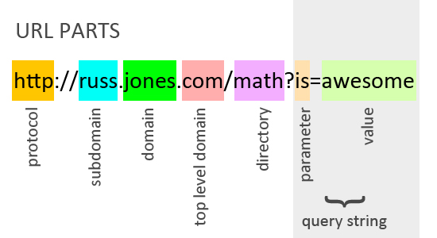

<!-- Run this slideshow via the following command: -->
<!-- reveal-md README.md -w -->


<!-- .slide: data-background="./header.svg" data-background-repeat="none" data-background-size="40% 40%" data-background-position="center 10%" class="header" -->
# Intro to Flask

### [Slides](https://make-school-courses.github.io/BEW-1.1-RESTful-and-Resourceful-MVC-Architecture/Slides/03-Intro-to-Flask.html)

### [Demo](https://github.com/Make-School-Courses/BEW-1.1-RESTful-and-Resourceful-MVC-Architecture/tree/master/Lessons/03-Intro-to-Flask/demo)

<!-- > -->

## Agenda

1. **Quiz: Timed, 20 minutes w/ 5 minute break**
1. [Learning Objectives](#learning-objectives)
1. [Welcome to Web Servers](#welcome-to-web-servers)
1. [Activity: Write a Function](#write-a-function)
1. [Add a Flask Route](#add-a-flask-route)
1. [Break](#break)
1. [Query Strings](#query-strings)
1. [HTML Forms](#html-forms)
1. [Homework](#homework)

<!-- > -->

## Learning Objectives

By the end of today, you should be able to:

1. Define what a web server is and how it relates to the backend.
<!-- .element: class="fragment" data-fragment-index="1" -->
2. Describe what the Flask framework is and how to use it.
<!-- .element: class="fragment" data-fragment-index="2" -->
3. Use what you've learned in CS and BEW classes thus far to build and run your first Python server implemented in Flask.
<!-- .element: class="fragment" data-fragment-index="3" -->

<!-- > -->

<!-- .slide: data-background="./header.svg" data-background-repeat="none" data-background-size="40% 40%" data-background-position="center 10%" class="header" -->
# Welcome to Web Servers

<!-- v -->

## What is a Web Server?

When you navigate to a web page:

1. The **client** (your browser) sends a request for that page's URL.
1. The **server** (e.g. a datacenter) sends a response containing HTML data.


<!-- .element: class="fragment" data-fragment-index="1" -->

<!-- v -->

## What is a Web Server?

A **web server** is a program that's running on a machine and waiting for a web request.

<!-- v -->

## What is Flask?

Flask is a **web framework** that helps us to define how to respond to web requests.

- **Which** web pages do we respond to
- **What** is in our response (in this case, HTML code!)

<!-- v -->

## Who uses Flask?

- Companies of all sizes (Google, Affirm, etc)
- Programmers working small/medium sided projects
- RESTful API creators and maintainers
- Data Engineers / Data Scientists
- Startups during the MVP phase

<!-- v -->

## How do I install it?

Open `Terminal.app`, and type the following command:

```bash
$ pip3 install flask
```

**PROTIP**: The `$` in front is a common paradigm that informs the programmer to execute the command in a terminal. Be sure not to type it out!

<!-- v -->

## Did I do it right?

You'll see output that looks like this:

```bash
DEPRECATION: Python 2.7 will reach the end of its life on January 1st, 2020.
Collecting flask
  Downloading https://files.pythonhosted.org/packages/9b/93/628509b8d5dc749656a9641f4caf13540e2cdec85276964ff8f43bbb1d3b/Flask-1.1.1-py2.py3-none-any.whl (94kB)
    100% |████████████████████████████████| 102kB 1.2MB/s
Collecting itsdangerous>=0.24 (from flask)
  Using cached https://files.pythonhosted.org/packages/76/ae/44b03b253d6fade317f32c24d100b3b35c2239807046a4c953c7b89fa49e/itsdangerous-1.1.0-py2.py3-none-any.whl
Collecting Werkzeug>=0.15 (from flask)
  Downloading https://files.pythonhosted.org/packages/d1/ab/d3bed6b92042622d24decc7aadc8877badf18aeca1571045840ad4956d3f/Werkzeug-0.15.5-py2.py3-none-any.whl (328kB)
    100% |████████████████████████████████| 337kB 6.3MB/s
Collecting click>=5.1 (from flask)
  Using cached https://files.pythonhosted.org/packages/fa/37/45185cb5abbc30d7257104c434fe0b07e5a195a6847506c074527aa599ec/Click-7.0-py2.py3-none-any.whl
Collecting Jinja2>=2.10.1 (from flask)
  Using cached https://files.pythonhosted.org/packages/1d/e7/fd8b501e7a6dfe492a433deb7b9d833d39ca74916fa8bc63dd1a4947a671/Jinja2-2.10.1-py2.py3-none-any.whl
Collecting MarkupSafe>=0.23 (from Jinja2>=2.10.1->flask)
  Using cached https://files.pythonhosted.org/packages/6d/d2/0ccd2c0e2cd93b35e765d9b3205cd6602e6b202b522fc7997531353715b3/MarkupSafe-1.1.1-cp27-cp27m-macosx_10_6_intel.whl
Installing collected packages: itsdangerous, Werkzeug, click, MarkupSafe, Jinja2, flask
Successfully installed Jinja2-2.10.1 MarkupSafe-1.1.1 Werkzeug-0.15.5 click-7.0 flask-1.1.1 itsdangerous-1.1.0
```

<!-- v -->

## How can I check?

Use the next **5 minutes** to:

  - **Compare** output from the previous slide with yours.

  - **Verify** that Flask installed correctly with everyone at your table.

  - **Escalate any errors _(text in <span style="color:red;">RED</span>)_ by raising your hand and informing the instructor or a TA.**

<!-- v -->

## So, what just happened?

- **What is `pip3`**?
    - Stands for _**P**ython **I**nstalls **P**ackages_
    - Included when you install Python

- Running `pip3 install packagename` installs the package in a special Python directory

<!-- > -->

# Write a Function

<!-- v -->

## Getting Started

Create a file named `app.py`:

 ```bash
 touch app.py
 ```

This `bash` command creates a blank file named `app.py` in your working directory.

<!-- v -->

## Getting Started

Open `app.py` in your favorite editor.

```bash
atom app.py
```

You'll **write all your code inside `app.py`** --- for now!

<!-- v -->

## Make a List of Compliments

Let's create a **list** containing our compliments in `app.py`:

```python
compliments = ['coolio', 'smashing', 'neato', 'fantabulous']
```

<!-- v -->

## Write a Function

Let's make the user feel really great whenever this function is called! Add the following to `app.py`:

```python
compliments = ['coolio', 'smashing', 'neato', 'fantabulous']

def get_compliment():
    compliment = compliments[0]
    return f'Hello there, user! You are so {compliment}!'
```

<!-- v -->

## Get a Random Compliment

At the very top of your file, type:

```python
from random import choice
```

Now we can change the `get_compliment` function like so:

```python
def get_compliment():
    compliment = choice(compliments)
    return f'Hello there, user! You are so {compliment}!'
```

<!-- v -->

## Demo

Let's run our function!

```bash
$ python3 app.py
>>> give_compliment()
'Hello there, user! You are so terrific!'
```

<!-- v -->

## Activity

Write a function `get_horoscope` that gives the user a random prediction for their day. Use the starter code to guide you.

```python
from random import choice

compliments = ['coolio', 'smashing', 'neato', 'fantabulous']

def get_compliment():
    compliment = choice(compliments)
    return f'Hello there, user! You are so {compliment}!'
```

<!-- > -->


## Break [10 minutes]
<!-- .slide: data-background="#087CB8" -->

<!-- > -->

# Add a Flask Route

<!-- v -->

## Flask + Function = Website

We'll make our function into a **route** so that it will display when the user visits our web page.

<!-- v -->

## Add Flask Imports

We'll need to **import** the `flask` library that we installed. Add the following to the top of `app.py`:

 ```python
from flask import Flask
...
 ```

<!-- v -->

## Define App Variable

Declare a variable named `app`, and instantiate the Flask class.

 ```python
from flask import Flask

app = Flask(__name__)

...
 ```

<!-- v -->

## Decorate the Function

Add `@app.route` to the top of the function. This **decorator** on top of the function makes it a **route**:

 ```python
...

@app.route('/compliment')
def get_compliment():
    compliment = random.choice(compliments)
    return f'Hello there, user! You are so {compliment}!'
 ```

<!-- v -->

## Declare The Entrypoint

Last, define `__main__` at the **bottom** of the file.

 ```python
 ...

if __name__ == "__main__":
   app.run(debug=True)
```

<!-- v -->

## Prove it Works

Test the function by running `flask run` on the terminal:

```bash
$ flask run
```

<!-- > -->

# Query Strings

<!-- v -->

## Query String Example

A **query string** is a way for the user to pass data through a URL.

Here's one example of a query string! It's kind of like a **variable**. What would that look like in our app?



<!-- v -->

## Import `request`

In `app.py`, change your import line to the following:

```python
from flask import Flask, request
```

<!-- v -->

## Extract a Query String

In your Flask app function, make another variable for the user:

```python
@app.route('/compliment')
def get_compliment():
    """Give the user a compliment"""
    name = request.args.get('name')
    compliment = choice(compliments)
    return f'Hello there, {name}! You are so {compliment}!'
```

<!-- > -->

# HTML Forms

<!-- v -->

## What is an HTML form?

An HTML **form** is a collection of **input elements**. Forms are useful for:

- Collecting user data
- Personalizing a web page

In this case, we want to know our user's name.

<!-- v -->

## Adding a Form

Let's add another route for `/` (aka the home page).

```python
@app.route('/')
def index():
    """Show the homepage and ask the user's name."""
    return """
    <form action='/compliment'>
        What is your name?
        <input type="text" name="name"></input>
        <button type="submit">
    </form>
    """
```

<!-- v -->

## More Form Components

HTML Forms can include the following:

- Text Box
- Password
- Dropdown
- Check Box
- Radio Buttons
- File Input
- Submit Button

<!-- v -->

## Checkbox

We can add a **checkbox** to our page:

```html
<input type="checkbox" name="show_compliments"/>
Show Compliments
```

<!-- v -->

## Drop Down

We can add a **dropdown** to our page:

```html
How many compliments?
<select name="num_compliments">
    <option value="1">One</option>
    <option value="2">Two</option>
    <option value="3">Three</option>
</select>
```

<!-- > -->

<!-- .slide: data-background="#0D4062" -->
## Homework

Complete your `Horoscope` project and use a Google Form to collect user data and make a more accurate prediction. Use the [starter code](https://github.com/Make-School-Courses/BEW-1.1-RESTful-and-Resourceful-MVC-Architecture/blob/master/Lessons/03-Intro-to-Flask/demo/app.py) as a guide!


