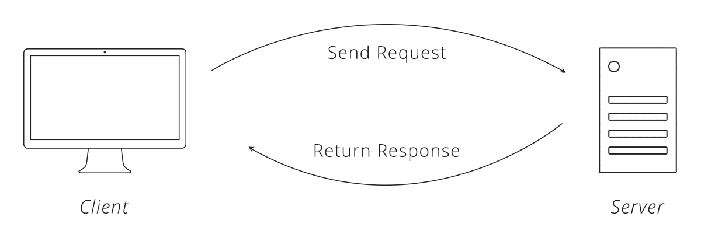
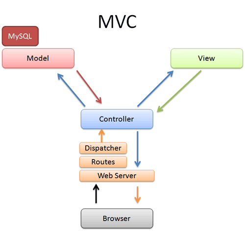
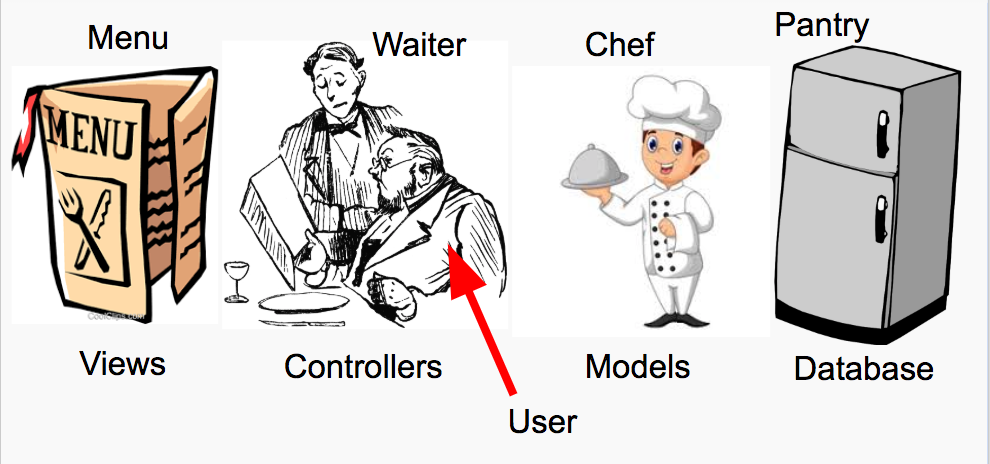
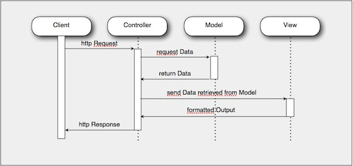

# Request Response Cycle and MVC Architecture

## Objectives

1. Define **Convention over Configuration**
1. Identify and describe the Request-Response Cycle
1. Identify and describe the Model View Controller convention
1. Define the **Separation of Concerns**

## Overview

For this course, we are going to zoom in on one layer: the **server**. The server is called a "server" because it serves data to anyone that asks properly. To make servers work, we could write raw, vanilla code, or we can use pre-made **Frameworks**. These frameworks follow standardized conventions. As web developers we have to learn those conventions to save time, and to make our code predictable for other developers. One of the primary conventions is the Model View Controller (MVC) convention.

## Activity: Every Day Conventions (10 min)

**Think, Pair, Share** - Think up 5 conventions that exist in ordinary day-to-day life. Share your list with a partner. Why do we follow these conventions? What are alternatives? What if we didn't follow them what would happen?

## The Request-Reponse Cycle (10 min)

The web is a network of computers with two types of nodes in the network. Clients, that request and display data, and servers that request and respond with data (but do not display it).

Clients and servers request data and servers respond to requests to data using one process called the **Request-Response Cycle**. Examples of clients are browsers, apps, and IoT devices like the Amazon Echo. Examples of servers are any website or web service on the internet.

## Model-View-Controller (10 min)

We could write all the code together in one file without spaces or new lines, the computer does not care, but that would be very hard for humans to work on.

Instead, we break up code into by **Concern** or area of functionality in order to simplify the process of writing web servers. This principle is called the **Separation of Concerns**. Basically "keep code together that do the same thing".

We want to always look for conventions to use, and be careful when we depart from conventions. We want to put **Convention over Configuration** - so that our code is standardized and recognizable by other developers.

Servers, who request and respond to data, have various ways that they are organized, but we will be learning the most common pattern called **Model View Controller** or **MVC**.

* **Model** - Where code goes that interfaces with a database.
* **Views** - Where code goes that users see and interact with (HTML).
* **Controllers** - Where code that defines routes, requests, and responses logic goes.

#### Analogy: MVC is a Restaurant

Here is a diagram of an integrated look at the Request-Response Cycle and MVC:

## Break (10 min)

## Introduction: Gif Search (45 min)

Go over the [Gif Search Project Spec](https://docs.google.com/document/d/1symUDRsZ1i2xf8F2mwAGFJtLjbOXqCj0JyrIgTtFNT0/edit?usp=sharing) and answer questions. (15 min)

Provide time for reading the spec, allowing people to find partners, etc. (30 min)

## Code Review (15 min)

You must get a code review on the Spaceman project before you submit it

**Question:** What are some code review best practices you learned from the [learning session](https://docs.google.com/presentation/d/1um-xrcB_gvxrsY0eAuFShDgNasNnoQUF-BBFJ9RiV54/edit?usp=sharing)?

Take some time right now to reach out to someone for a code review!

## Homework

1. Get a code review on your Spaceman project before you submit it. **Put the name of the code reviewer, and link to the commit that was reviewed in the progress tracker**
1. Install [Emmet](https://emmet.io/) or another HTML snippet package to your text editor to make you fast at HTML writing.
1. [GA's Free Dash Tutorial (HTML/CSS)](https://dash.generalassemb.ly/)
1. [Learn CSS in 12 Min](https://www.youtube.com/watch?v=0afZj1G0BIE) (Video - 12 min)
1. [Code Academy JavaScript](https://www.codecademy.com/learn/introduction-to-javascript)
1. [CSS Cross-Country (Only Lesson 1)](https://www.codeschool.com/courses/css-cross-country) (Tutorial - 45min)
1. [Semantic HTML (Videos 2 hrs)](https://www.youtube.com/playlist?list=PLWjCJDeWfDdc0Sp_DinOWnodw3KnWCwc1)

## Resources

1. [Request Response Cycle Code Academy](https://www.codecademy.com/articles/request-response-cycle-static)
1. [What is Programming in MVC](https://www.youtube.com/watch?v=1IsL6g2ixak)
