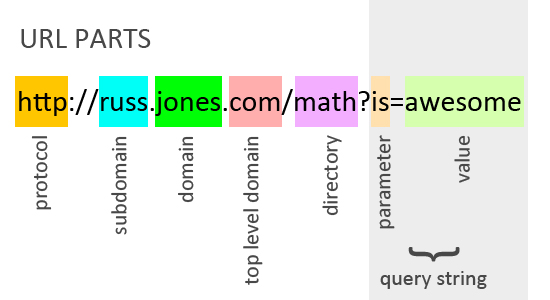

<!-- Run this slideshow via the following command: -->
<!-- reveal-md README.md -w -->


<!-- .slide: data-background="./header.svg" data-background-repeat="none" data-background-size="40% 40%" data-background-position="center 10%" class="header" -->
# URLs, HTTP, REST, and Reading Errors

<!-- > -->

## Learning Outcomes

1. Describe the uses of an API 
1. Write an API request using `curl`
1. Describe the purpose of JSON and use Python to access JSON data
1. Use the `requests` library to write an API request

<!-- > -->

# Warm-Up

<!-- v -->

## Warm-Up

1. What is a route?
1. What is a template, and why do we use templates? 
1. I want to display a template called `marshmallows.html` on the web page `/candy`. What steps should I follow?

<!-- > -->

# APIs

<!-- v -->

## Review: URLs & Requests

The web works with a series of unique addresses like the postal service. These addresses are called URLs or **Uniform Resource Locator**.



<!-- v -->

## APIs

- **A**pplication **P**rogramming **I**nterface
- Used to get data from a web URL
- Just like a normal website! Except instead of serving HTML, it is serving JSON data
- We want to use that data in our web app

<!-- v -->

## Example: Chuck Norris API

Get a random Chuck Norris joke!

http://www.icndb.com/api/

<!-- v -->

## URL Query Parameters

What if I only want a nerdy joke?

http://api.icndb.com/jokes/random?limitTo=nerdy

<!-- v -->

## Introducing: `curl`

We can also execute this same API query in Terminal:

```bash
$ curl "http://api.icndb.com/jokes/random?limitTo=nerdy"
```

And we get the result:

```json
{ "type": "success", "value": { 
    "id": 505, 
    "joke": "Chuck Norris can spawn threads that complete before they are started.", 
    "categories": ["nerdy"] }
}
```

Try it out!

<!-- v -->

## Summary

- APIs don't make any assumptions about how you will *use* the data.
- Thus, they tend to give you more data than is necessary.

<!-- > -->

# JSON

<!-- v -->

## What is JSON?

- **J**ava**S**cript **O**bject **N**otation 
- A standard format for transmitting data across the web and between different programming languages
- Consists of **key-value pairs**:
  - Key is a string
  - Value could be a **primitive** (string, number), a **list**, or another JSON **object**

<!-- v -->

## Activity

With a partner, see if you can determine what this JSON data represents:

```js
{
  "Order#": "309873457",
  "Name": "Jeff Bezoz",
  "Items": [
    { "Item_Name": "Used Tissue", "Price": 4.99 },
    { "Item_Name": "Elon's Musk", "Price": 2500 },
    { "Item_Name": "Bill's Gates", "Price": 1495.01 }
  ],
  "Address": "2000 Pennsilvania Avenue, Washington D.C.",
  "Total": 40000
}
```

<!-- v -->

## Accessing JSON

We can make a JSON object in our Python code:

```python
>>> my_json = { "name": "Meredith", "num_cats": 1, "is_student": False }
```

And access it like:

```python
>>> my_json['num_cats']
1
```

<!-- > -->

# Activity: Cards API

<!-- v -->

## Deck of Cards API [25 mins]

1. Point your browser to http://deckofcardsapi.com
1. Using `curl`, follow the steps to create a deck of cards, draw 2 cards, and reshuffle
1. See how far you can get!


<!-- v -->

## Let's play Blackjack!

Aim of the game: Get as close to 21 as you can without going over! With a partner:

1. Draw 1 card from a new deck - This card is shared
1. From the *same* deck (but on different computers), each person draw 2 cards
1. On your turn: Decide whether to stay or draw another card

#### J/K/Q worth 10, A worth either 1 or 11 (you choose)


<!-- > -->

# The requests Library

<!-- v -->

## Install requests

Install the `requests` library:

```bash
$ pip3 install requests
```

<!-- v -->

## Using requests

Use the `requests.get` function to send a GET request to your API.

This function returns a `Response` Object. We need to call `.json()` to get the JSON data.

```python
>>> import requests

>>> r = requests.get("http://api.icndb.com/jokes/random?limitTo=nerdy")
>>> joke_json = r.json()
```

<!-- v -->

## Get the Data

Remember that our JSON data looks like this:

```python
{ "type": "success", "value": { 
    "id": 505, 
    "joke": "Chuck Norris can spawn threads that complete before they are started.", 
    "categories": ["nerdy"] }
}
```

Once we have a JSON object, we can extract the fields we want using bracket notation:

```python
>>> joke_str = joke_json["value"]["joke"]
>>> joke_str
"Chuck Norris can spawn threads that complete before they are started."
```

<!-- v -->

## Set the Query String

The part of the URL after the `?` is the **query string**.

```txt
http://api.icndb.com/jokes/random?limitTo=nerdy
```

If our URL has a lot of query parameters, it can get a little messy.

```txt
http://fakeapi.com/search?term=wow+very+long&filter=much+long+wow&name=whoa+cool+person
```

<!-- v -->

## Set the Query String

We can use `requests` to set the query string for us:

```python
my_params = {
    "term": "wow very long",
    "filter": "much long wow",
    "name": "whoa cool person"
}
r = requests.get("http://fakeapi.com/search", params=my_params)
```

<!-- > -->

# Flask and APIs

<!-- v -->

## Let's Make a `/joke` Flask Route

```python
import requests
from flask import Flask

app = Flask(__name__)

@app.route('/joke')
def make_joke():
    params = { "limitTo": "nerdy" }
    r = requests.get("http://api.icndb.com/jokes/random", params=params)
    joke_json = r.json()
    joke_str = joke_json["value"]["joke"]
    return joke_str
```

<!-- v -->

## Run the Server

Let's try running it!

```bash
$ export FLASK_ENV=development
$ flask run
```

<!-- > -->

# Gif Search

<!-- v -->

## Demo

Demo

<!-- v -->

## Request an API Key

Go to https://tenor.com/developer/dashboard and request an API key!

<!-- v -->

## Use Your API Key

```python
import requests

params = {
    "q": query_term,
    "Key": "WL6NLFPEQRYR"
}
response = requests.get(
    'https://api.tenor.com/v1/search',
    params=params)
```

<!-- > -->

## Resources

1. [Slides](https://docs.google.com/presentation/d/1PfQ_apXeAe56HwJia4FwP9rg6f4Awj95MbrsqxdUMZE/edit?usp=sharing)
1. [What is HTTP?](https://www.youtube.com/watch?v=SzSXHv8RKdM)
1. [Explained HTTP, HTTPS, SSL/TLS](https://www.youtube.com/watch?v=po3zYOe00O4)
1. [REST Wikipedia Article](https://en.wikipedia.org/wiki/Representational_state_transfer)
1. [REST & HTTP](https://www.youtube.com/watch?v=LHJk_ISxHHc)
1. [Intro to REST](https://www.youtube.com/watch?v=YCcAE2SCQ6k)
