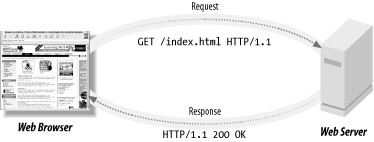
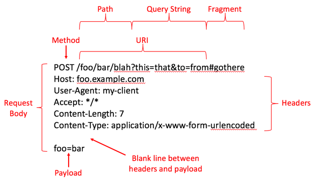
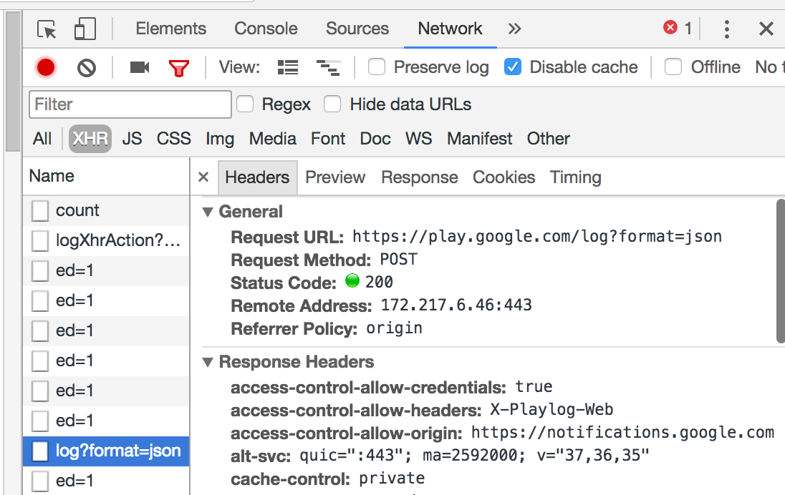

# URLs, HTTP, REST, and Reading Errors

## Learning Outcomes

1. Describe the uses of an API client library
1. Identify and describe each part of a URL and HTTP Request.
1. Identify and use RESTful and URL routes
1. Read and interpret errors to find out your next step (google them!)


## Initial Exercise 10 min.

1. Write your home address out and diagram what each part is called.

## URLs & Requests

The web works with a series of unique addresses like the postal service. These addresses are called URLs or **Uniform Resource Locator**.

They are the most obvious part of any request to a server.



URLs have a distinct anatomy and as a web developer you ought to memorize each part of a url - just as if you were a postal worker, you'd need to know what a zip code was!


URLs are the surface level of any request to a web server. However, there is more information in a request.



To view more about a request use the Sources tab of your Chrome web tools. Load a web page and click XHS and then select the request you want to review.



## REST & HTTP

REST is the most widely used standard convention for web server behavior. You'll research more about REST in the challenges below.

HTTP is a protocol that we use to send and receive requests between servers and clients. HTTP has **HTTP Verbs** and **HTTP Statuses** and you should memorize both.

HTTP Verbs are the following:

1. GET
1. POST
1. PUT
1. PATCH
1. DELETE

The most common HTTP statuses are the following. Here is a [complete list](https://httpstatuses.com):

* 100 - Informational Response
* 200 - Success
* 300 - Redirection
* 400 - Client Error (Bad Request)
* 401 - Unauthorized
* 404 - Not found
* 418 - [I'm a tea pot](https://httpstatuses.com/418)
* 500 - Internal Server Error

## JSON

**JavaScript Object Notation** (JSON) is the standard format for transmitting human readable data across the web.  These consist entirely of key-pair values, but these values can be arrays as well as single values.

This is an example of JSON:

```js
{
  "Order#": "309873457",
  "Name": "Jeff Bezoz",
  "Items": [
    "Used Tissue",
    "Elon's Musk",
    "Bill's Gates"
  ],
  "Address": "2000 Pennsilvania Avenue, Washington D.C.",
  "Paid": 40000
}
```

Keys like `Order#` and `Name` pair to strings, while the `Items` key is paired to an array, holding multiple values.  

JSON is referenced using dot notation, so referencing it should look similar to class attributes and methods in Python.  

Lets say we have a super simple Flask app with a single endpoint, receiving the JSON data shown above.  

```py 
from flask import Flask

app = Flask(__name__)

@app.route("/JSON", methods=['POST']):
def json_receiving_endpoint():
    ...
```

We can reference the JSON in the request (if it exists) by using `request.get_json()`, and then using dot notation to get specific values like this:

```py
    ...
    data = request.get_json()
    print(data.Name)
    print(data.Items[1])
    print(data.Paid)    
```

which would print the following to your console when the endpoint gets a request:

```
    Jeff Bezoz
    Elon's Musk
    40000
```

Note that while JSON isn't always case-sensitive in the wild, its conventional and expected of clean code.

## Activity #1 - Programmatically access JSON data
Using the [Chuck Norris API]("https://api.chucknorris.io/"), write a Flask endpoint that returns a random Chuck Norris joke as a string, using the server code above or writing your own.  You can simply use a `return` statement here, as it will send the string as a response.  

## API Client Libraries
API Client Libraries can be described as cutting the middle man out of working with external code, and often make it so you don't even have to deal with JSON.  Normally, accessing services programmatically can be a hassle and make your code more convuluted but client libraries are essentially classes, with attributes and methods, that are designed to reduce configuration time while lending themselves easily to all use cases.

A normal API call requires you to:

 1. copy and paste a hard coded URL
 2. format it with query parameters in the right places
 3. send a fetch request
 4. Parse the request into a workable format

Client Libraries make developers lives a lot easier because you only have to:

1. Import the library
2. Use the provided functions and syntax

This allow for more predictable output from the API, cleaner code, and in most cases is much faster to implement.  API wrappers and some python packages are examples of API client libraries.

## Activity #2 - Getting Comfortable With URL Queries

Raw API Blackjack

###### Find a partner, and both will need to have the code and run it

We'll be using the [Deck of Cards API]("http://deckofcardsapi.com/").  First, read the documentation on the Deck of Cards API website.  One person has to shuffle a new deck with an API call and share the deck ID with a partner. 

Now both people should open Postman and create a query to draw 2 cards from the same deck which will be the hand for each player.  Open another tab in postman and make a new query for a single card from the same deck. 

Now both players should query for a starting hand, and decide to draw with the single card query or stay with their hand, each trying to get as close to 21 without going over (going over 21 is an instant loss).  If you want to draw multiple times, make a new tab or redraw and remember your previous cards.

The person that didn't create the deck should open another tab in Postman and reshuffle the same deck (not the same as making a new one).  Play a best of 3 to complete the activity.  


## Homework

Write a sentence in a notebook and take a picture, or download an image with text in it.  Using [Pytesseract]("https://pypi.org/project/pytesseract/")'s API client library, and write a script that outputs the text of that image.  

You'll need to install the Pillow package for image processing: 

```sh
pip3 install pytesseract
pip3 install pillow
```

and to import them in your script:

```py
from PIL import Image
import pytesseract
```

Then you can simply declare the image with Pillow like so:

```py
picture = Image.open("filename.png")
```

**Submission:** Make a repo and push your script up to GitHub. Place a link to your repo in the progress tracker

## Resources

1. [Slides](https://docs.google.com/presentation/d/1PfQ_apXeAe56HwJia4FwP9rg6f4Awj95MbrsqxdUMZE/edit?usp=sharing)
1. [What is HTTP?](https://www.youtube.com/watch?v=SzSXHv8RKdM)
1. [Explained HTTP, HTTPS, SSL/TLS](https://www.youtube.com/watch?v=po3zYOe00O4)
1. [REST Wikipedia Article](https://en.wikipedia.org/wiki/Representational_state_transfer)
1. [REST & HTTP](https://www.youtube.com/watch?v=LHJk_ISxHHc)
1. [Intro to REST](https://www.youtube.com/watch?v=YCcAE2SCQ6k)
