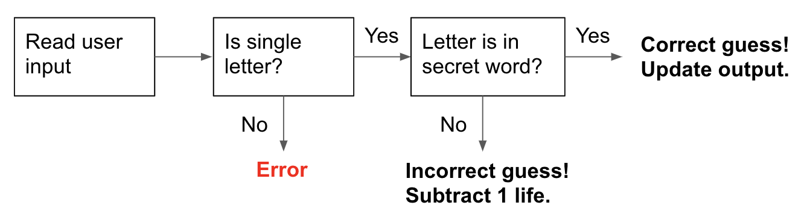

<!-- Run this slideshow via the following command: -->
<!-- reveal-md README.md -w -->


<!-- .slide: data-background="./header.jpg" data-background-repeat="none" data-background-size="40% 40%" data-background-position="center 10%" class="header" -->
# Testing RESTful Routes

### [Slides](https://make-school-courses.github.io/BEW-1.1-RESTful-and-Resourceful-MVC-Architecture/Slides/06-Testing-RESTful-Routes.html ':ignore')
### [Demo](https://github.com/Make-School-Courses/BEW-1.1-RESTful-and-Resourceful-MVC-Architecture/tree/master/Lessons/06-Testing-RESTful-Routes/demo)

<!-- > -->

## Agenda

1. **Quiz: Timed, 20 minutes w/ 5 minute break**
1. FSP Support Survey
1. [Learning Objectives](#learning-objectives)
1. [Why Test Our Routes?](#why-test-our-routes?) 
1. [Forms of Testing](#forms-of-testing)
1. [Unit Tests](#unit-tests) 
1. [Break](#break)
1. [Route Tests](#route-tests)

<!-- > -->

## Quiz [20 mins]

### 5 mins break
<!-- .slide: data-background="#087CB8" -->

<!-- > -->

## FSP Support Survey (5 mins)

**What Are The New FSP Level Up Sessions?**

Required hour long sessions Mon/Tue/Wed/Thu where we will:

1. Review old material
1. Do slower and more in-depth explanations
1. Explain how to think programmatically

**Survey link:** [make.sc/fsp-support-survey](http://make.sc/fsp-support-survey)

<!-- > -->

## Learning Objectives

1. List various types of automated tests
1. Define unit tests and how to implement them in Python
1. Implement route tests for one resource
1. List when it is ok to test and not to test

<!-- > -->

# Why Test Our Routes?

<!-- v -->

## What is Automated Testing?

**Manual testing** means manually running your program many times, with various test cases.
<!-- .element: class="fragment" data-fragment-index="1" -->
- Example: How you (probably) tested Spaceman
<!-- .element: class="fragment" data-fragment-index="2" -->

**Automated testing** is writing code that tests your code *for you*.
<!-- .element: class="fragment" data-fragment-index="3" -->
- Example: Writing code that tests the correctness of Spaceman - either a single function, or the entire program
<!-- .element: class="fragment" data-fragment-index="4" -->

<!-- v -->

## Why Learn Automated Testing?

1. Ensures that your next change won't break anything that was previously working<!-- .element: class="fragment" data-fragment-index="1" -->
  - These are called **regression** tests 
1. Other developers can contribute to your project without fear of breaking it<!-- .element: class="fragment" data-fragment-index="2" -->
1. Improves accuracy of your code - easier to test many edge cases<!-- .element: class="fragment" data-fragment-index="3" -->
  - What is an **edge case**?

<!-- v -->

## When Is Testing A Lower Priority?

1. Small projects<!-- .element: class="fragment" data-fragment-index="1" -->
1. Solo projects<!-- .element: class="fragment" data-fragment-index="2" -->
1. Private (not public) projects<!-- .element: class="fragment" data-fragment-index="3" -->


<!-- > -->

# Forms of Testing

<!-- v -->

## How can I test my code?

We'll go over a couple of the most foundational tests you can run on your projects:

1. **Unit Testing** - tests a single function
1. **Route Testing** - tests what is served by a single route

<!-- v -->

## What is 'test coverage'?

Writing these tests will help us achieve comprehensive **test coverage**. If a feature has an automated test associated with it, it is considered "covered". 



A project with **100% test coverage** has all its features covered by tests.

<!-- > -->

# Unit Tests

<!-- v -->

## What are Unit Tests?

**Unit tests** test the output or return value of a single function.

They are very **resilient** and will rarely break as you make changes to your code, but they provide very _narrow test coverage_ to your application as a whole so you have to write a lot of them.

Python has a built in unit test library called [unittest](https://docs.python.org/3.7/library/unittest.html) that we'll use for running our unit tests going forward.

<!-- v -->

## Example

Here's an example of a unit test that checks the output of a `greet_by_name` function. Check out the comments for details. Let's call this file `test_greeting.py`:

```python
# test_greeting.py
# Import in the Python unittest library
import unittest

# Declare our function
def greet_by_name(name):
  greeting = "Hello, " + name + "!"
  return greeting

# Q: What's the class keyword mean here? 
# A: You'll find out in the CS OOP classes coming soon!
# For now, know that your tests must look like this.
class GreetByNameTests(unittest.TestCase):
    # For each test in the class, make a method where self is the parameter
    def test_default_greeting(self):
        # the actual test
        self.assertEqual(greet_by_name('Dani'), 'Hello, Dani!')

# run the tests
if __name__ == '__main__':
    unittest.main()
```

<!-- v -->

## Assertions

What does `assertEqual` mean? This is an example of an assertion! 

An **Assertion** is a true/false statement that defines a test. In the above example, we're testing to make sure the `greet_by_name('Dani')` function returns `Hello, Dani!` as an answer.

<!-- v -->

## Run the Test

If you were to run this function, you'd see the following output:

```bash
➜  ~ python3 test_greeting.py
.
----------------------------------------------------------------------
Ran 1 test in 0.000s

OK
```

Great! Our test passed!

<!-- v -->

## Question

What would happen if we change:

```python
self.assertEqual(greet_by_name('Dani'), 'Hello, Dani!')
```

To the following:

```python
self.assertEqual(greet_by_name('Dani'), 'Hello, Meredith!')
```

<!-- v -->

## Fail!

Our two parameters to `assertEqual` no longer match, so the test would fail!

```bash
➜  ~ python3 test_greeting.py
F
======================================================================
FAIL: test_default_greeting_set (__main__.GreetByNameTests)
----------------------------------------------------------------------
Traceback (most recent call last):
  File "test_greeting.py", line 10, in test_default_greeting_set
    self.assertEqual(greet_by_name('Dani'), 'Hello, Meredith!')
AssertionError: 'Hello, Dani!' != 'Hello, Meredith!'
- Hello, Dani!
+ Hello, Meredith!


----------------------------------------------------------------------
Ran 1 test in 0.001s

FAILED (failures=1)
```

<!-- v -->

## Activity: You Try!

Remember the first draft of your `get_compliments()` function from the Compliments app?

```python
compliments = ['coolio', 'smashing', 'neato', 'fantabulous']

def get_compliment():
    compliment = compliments[0]
    return f'Hello there, user! You are so {compliment}!'
```

Write a test file called `test_compliment.py` and test it out! See if you can break the test.

<!-- > -->

## Break [10 minutes]
<!-- .slide: data-background="#087CB8" -->

<!-- > -->

# Route Tests

<!-- v -->

## What is Route Testing?

**Routes Testing** is in a bit of a Goldilocks position where it is broad and tests a lot of behavior, but they are not too brittle such that they will break when we change something minor like the styling.

<!-- v -->

## What does "Brittle" mean?

How easily a test breaks. A test that is too brittle tests "too much", and if it is not brittle enough it tests "too little". e.g. `assert(a == a)` is not brittle enough.

<!-- v -->

## Route Testing Example

Back to testing routes, here's an example of testing a route, adapted from [Damyanon](https://damyanon.net/post/flask-series-testing/):

```python
# First we need to import our app.
# This test file should be in the same folder as your app.py file
from app import app
import unittest 

class AppTests(unittest.TestCase): 
    
    # This runs implicitly before any tests are run
    # We use this to set up our app before we test on it
    def setUp(self):
        # creates a test client
        self.app = app.test_client()
        # propagate the exceptions to the test client
        self.app.testing = True 

    def test_home_status_code(self):
        # sends HTTP GET request to the application
        # on the specified path
        result = self.app.get('/') 

        # assert the status code of the response
        self.assertEqual(result.status_code, 200) 
```

<!-- v -->

## Activity: Test GIF Search!

Work with your partner and write some route tests for your GIF Search project! 

**Stretch Challenge:** Write some unit tests for GIF Search as well

<!-- > -->

## ConcepTest

Which form of testing is the most efficient? (i.e. is the least brittle while providing the most test coverage)

<ol type="A">
  <li>Unit Tests</li>
  <li>Routes Tests</li>
</ol>

<!-- > -->

<!-- .slide: data-background="#0D4062" -->
## Homework

Continue working on GIF Search with your partner! **Remember to log your pair programming session in the tracker!**

**Stretch Challenge:** Aim for full test coverage of your GIF Search project!

<!-- > -->

## Resources
- [Python unittest docs](https://docs.python.org/3/library/unittest.html)
