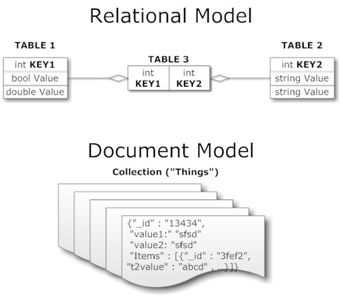
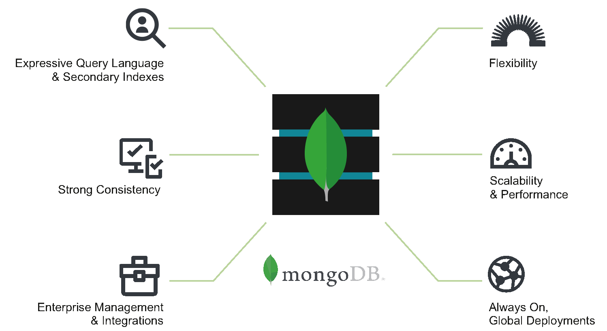
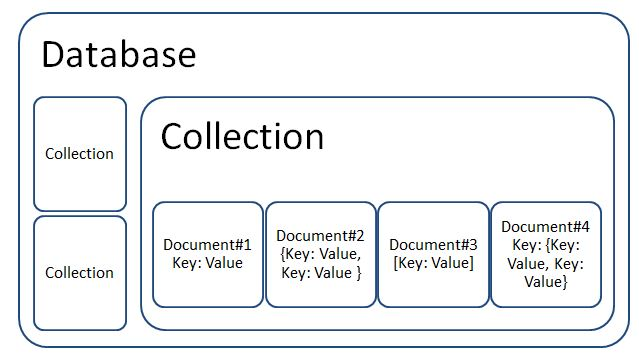

# Document-Based Databases and Flask PyMongo


## Learning Outcomes

1. Identify the pros and cons of a NoSQL or Document-based database
1. Get comfortable with Mongo queries.
1. Understand how to connect and use MongoDB in a Python web app


## Document-Based Databases / NoSql Overview

Document-Based Databases stores data in flexible structures called **documents** that stores and queries data similar to JSON. They are also called **NoSql** or **non-relational** because they don't use the more traditional, **relational** methods of storage, which go beyond the scope of this class.



We'll go over the specifics of these **collections** in a bit.

## MongoDB



MongoDB is an open source (free!) database that operates using these **documents** which for our purposes we can think of a repository of Dictionaries, since this is how these are represented under the hood in Flask PyMongo.

In this lesson you'll set up a MongoDB server, and use Flask PyMongo which acts similar to an **API client library**, letting engineers CRUD from their database programmatically.

But first, we need some more info about this new database.  MongoDB gives each document a unique identification number with the key **_id** (underscore included, indicating it is internally important to Mongo).  We'll use that **_id** attribute to retrieve the whole document later.  MongoDB is sort of like dropping clothes off at the dry-cleaners.  They put a number on each piece of clothing and give you a ticket for each one.  Later we can get that clothing back by matching our ticket to the right number.


So, if we saved a new project like this to a MongoDB database:

```py
# PYTHON DICTIONARY OBJECT
{ "title": "A New Project" }
```

Then it will save something like this

```js
// MongoDB OBJECT
{
  _id: "507f1f77bcf86cd799439011",
  title: "A New Project"
}
```

Documents are grouped into **collections**, and these collections should have the same name as your resources. So a `User` resource should have a `users` collection and an `Article` resource should have an `articles` collection.  Below is a visualization of how collections and resources (key-pair dictionaries) are organized.



Why use a Document-Base Database?

### Pros

1. Writes fast
2. No migrations - more flexible and easy to start
3. "Schemaless" - can save anything you want regardless of datatype or schema

### Cons

1. Slow to traverse (search)
1. Slow to read from
1. No migrations - more flexible and easy to start
1. "Schemaless" - can become unstructured

## Break - 10 min

## Now let's get our hands dirty

### MongoDB Queries

[Mongo Shell Quick Reference](https://docs.mongodb.com/manual/reference/mongo-shell/) - Use this to manually manipulate your database.

[Robo 3T](https://robomongo.org/) - A GUI (graphics user interface) for MongoDB.  Lets you visualize, understand, and confirm that your database works.

Learning the MongoDB shell is useful for quickly getting info from your database, addressing errors, and manually inserting data.  You can even use it to create dummy data for testing your apps!

#### Live Code - most common queries

You can think of queries as the language through which you ask Mongo for the data you want.  Here's a list of some of the most used queries:

Documentation can be found [here](https://docs.mongodb.com/manual/tutorial/getting-started/).

`find(query)` - can be combined with search terms like `.find({ age: 18 })` or to select all documents can be passed an empty query `.find({})`.  Returns all documents matching the query.

`find_one(query)` - gets the single most relevant document to the given query.  If no query is given, returns the first document in the database.  Used to find a document by an _id.

`insert_one(object)` - insert (create) a new document in the database.  Will only add one document per function call.  Read the documentation for `bulk write operations` if you want to add more than one.  Adding an item with an _id identical to one in the database will throw a `duplicate key error`.

`sort(attribute)` - will sort a given list of resources by the attribute given as a parameter.  Can also be called on an entire resource like `db.Books.sort("author")`


## Activity #1: From Mongo Query to English

Use the Mongo documentation and write the following queries in plain English.  Find a partner and see what you came up with, and then we'll go over the answers as a class.

```py
db.People.find().sort({ age: 1 }).limit(100)

db.Events.findOne({ name: "Burning Man" })

db.Cars.findById(request.args.carId)

db.Apps.findOne({ quality: "Great" }) # obviously won't return Snapchat or Lyft
db.Users.find({ age: {$gt: 18, $lt: 65 }})

db.Users.find({likes: {$in: ['chatting', 'candle making']}})
```

## Using Flask PyMongo


[PyMongo Docs](https://api.MongoDB.com/python/current/) - PyMongo is the lower level toolset (released by python) that you'll use to query the database for the stuff you want.  You can import this from Flask PyMongo.

[Flask PyMongo Docs](https://flask-pymongo.readthedocs.io/en/latest/) - A useful wrapper around PyMongo (and for your convenience comes packaged with PyMongo) that adds helper functions specifically for Flask.

After installing and importing Mongo (read the docs!), lets see how we can tell a Flask application where our database is.

To do so, we populate an environment variable recognized in the Flask configuration `MONGO_URI`.  This string specifies where the database server instance is and which database we want

`mongodb://server:port/databaseName` (the default port is 27017)

```py
app.config["MONGO_URI"] = "mongodb://localhost:27017/myApp"
```

Then we create a mongo object using our app that represents our connection to Mongo and exposes the database.

```py
db = PyMongo(app)
```

FINALLY- we're ready to use our new Mongo database.  Using the same Mongo syntax you saw before, here's an example of how we would make a GET endpoint that would return all `users` stored in our database (in Flask):

```py
@app.route("/users")
def get_all_users(methods=["GET"]):
  users_list = db.users.find({}) # empty query returns all
  # returning the user list in JSON for example
  from flask import jsonify
  return jsonify(users_list)
```

*Note that we would need import the file with the database object `db` if the endpoint isn't in the same location.

Say we're trying to store user data from a sign up form on the frontend, sending us back form data:

```js
{
  "username": "Shrek",
  "password": "onions",
  "bio": "It's never ogre",
  "agreed_to_terms": true,
}
```

We can save that to Mongo, which will create a model for the data you input if one doesn't already exist.  These models are key-value pairs that serve as templates for a resource.  You can access specific parts of that data using dot notation like JSON.  You can also create a dictionary like `new_user` below and assign specific parts of the data to it:

```py
# THIS IS AN EXAMPLE OF DOCUMENT BASED DATABASES, NOT USER AUTHENTICATION
@app.route("/users")
def create_user(methods=["POST"]):
  # format form data to JSON
  data = request.get_json()
  # make sure they agreed to terms of service
  if data.agreed_to_terms:
    # create new user-  You can also make classes to define these models and enforce their behavior by creating a new class instance instead of a dictionary here
    new_user = {
      "username": data.username,
      "password": data.password,
      "bio": data.bio
    }
    # save the new object to the db
    db.users.insert_one(new_user)
    # return success response - assume we have jsonify imported
    return jsonify({"ok": True, "message": "User successfully created!"}), 200
  else:
    # did not agree to the terms of service response
    return jsonify({"ok": False, "message": "You must agree to the terms of service to become a new user"}), 401
```

You could also use `mongo.db.users.insert_one(response)` and usually that's easier, but like the example above, you might not want to make space in every `user` instance for `agreed_to_terms` if you can just validate this in the endpoint.  Reducing the data that the resource needs to hold will make transactions faster and obviously use less memory.

## Activity #2 - Using a database

Consider this JSON data:

```json
{
  "Order#": "309873457",
  "Name": "Jeff Bezoz",
  "Items": [
    "Used Tissue",
    "Elon's Musk",
    "Bill's Gates"
  ],
  "Address": "2000 Pennsilvania Avenue, Washington D.C.",
  "Paid": 40000
}
```

Now that you know how everything works, try it yourself.  Set up a Mongo connection to a barebones Flask app (given below).  Write endpoints to CRUD the resource that this data represents to/from your database.  Store all of the information from the form (that should make your life easier if you're doing it right).  This is assuming your virtual environment is set up properly, as this will affect our MONGO_URI environment variable.

You don't need to make more than one file for this activity, although in the future we'll modularize our database code.

```py
# Import necessary dependencies.
from flask import Flask

# Initialize your Mongo connection and create the Mongo variable.
app = Flask(__name__)


@app.route("/get_all"):
  ...
  # Fill the rest in to complete the CRUD operations.
  # It might seem like a lot, but PyMongo was designed for this!
  # Typically, CRUD endpoints shouldn't be more than a few lines of code.
```

## Stretch Challenge

Write an API endpoint that lets you input MongoDB queries in plain text as a request parameter, and return the result of that query in your database.  The URL would look something like

`localhost:8000/q?find({"name": "Jeff Bezos"})`
