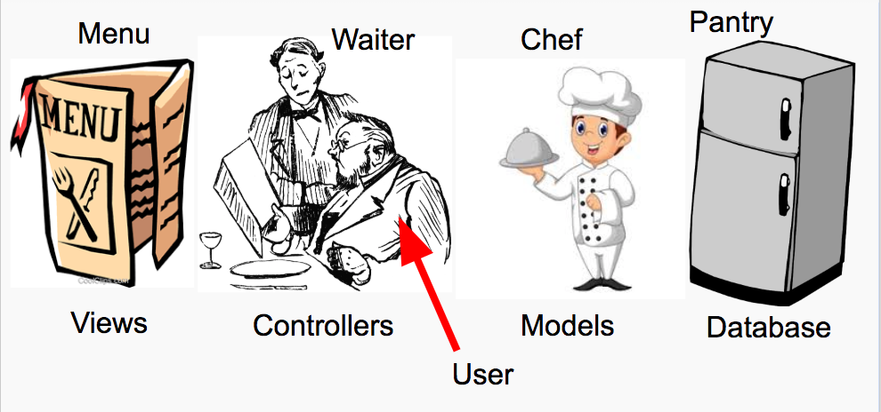
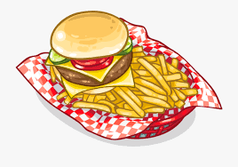

<!-- Run this slideshow via the following command: -->
<!-- reveal-md README.md -w -->

<!-- .slide: data-background="./header.svg" data-background-repeat="none" data-background-size="40% 40%" data-background-position="center 10%" class="header" -->
# Model, View, Controller

<!-- > -->

## Agenda

1. Essential Question & Discussion [15 mins]
1. Model, View, Controller [20 mins]
1. Activity [40 mins]
1. How Flask works / Quiz review [25 mins]

<!-- > -->

## Essential Question

How do pages on the Web communicate with each other?

<!-- v -->

## Think, Pair, Share [15 mins]

Let's say I go to Amazon.com, search for an item, and put it into my shopping cart.

*How* does this happen? If Amazon were an app written in Flask, what would it look like? Write down *everything* you know.

<!-- > -->

# Model, View, Controller

<!-- v -->

## Overview

When we write code for a web server, we typically use a convention known as **Model, View, Controller**.

<!-- v -->

## View

The **view** is like the menu.

In our Flask application, our **views** are the HTML pages. 

<!-- v -->

## Controller

The **controller** is like the waiter.

In our Flask application, the **controller** is the routes contained in `app.py`.

<!-- v -->

## Model

The **model** is like the food!

In our Flask application, the **model** is the data being passed back and forth between the client and server.

