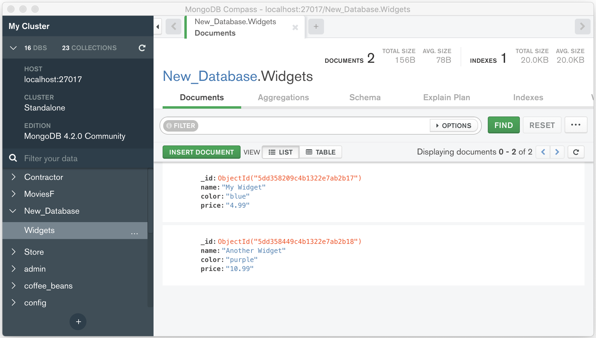

<!-- .slide: data-background="./../Images/header.svg" data-background-repeat="none" data-background-size="40% 40%" data-background-position="center 10%" class="header" -->
# Document-Based Databases

### [Slides](https://make-school-courses.github.io/BEW-1.1-RESTful-and-Resourceful-MVC-Architecture/Slides/08-Document-Based-Databases/README ':ignore')
### [Demo](https://github.com/Make-School-Courses/BEW-1.1-RESTful-and-Resourceful-MVC-Architecture/tree/master/Lessons/08-Document-Based-Databases/demo)

<!-- > -->

## Warm-Up

1. In what situations would we want to use mocks to test our code?
1. If I am testing a call to an API, which *function* should I mock?

<!-- > -->

## Learning Outcomes

1. Use MongoDB Compass Connect to create and view items in a database
1. Get comfortable with Mongo queries
1. Understand how to connect and use MongoDB in a Python web app

<!-- > -->

# Document-Based Databases

<!-- v -->

## Overview

Document-Based Databases:

- Store data in **documents** similar to JSON
- Also called **NoSql** or **non-relational** because they don't use the more traditional, **relational** methods of storage


<!-- v -->

## MongoDB

- Can have several **databases**. Use 1 database for 1 project.

- A database can have several **collections**. Each collection groups objects of the same type: User, BlogPost, Item, etc.
  - `User` resource would be stored in `users` collection
  - `BlogPost` resource would be stored in `blog_posts` collection

- Each collection supports **CRUD** operations

<!-- v -->

## What is CRUD?

- **C**reate, **R**ead, **U**pdate, **D**elete

- Represents the operations we can do on any one type of object

- Example - Users: Create a new user, show all users, update a user, delete a user

<!-- v -->

## Identifiers

MongoDB gives each document a unique identification number with the key `_id`. 

It's sort of like dropping clothes off at the dry-cleaners: you are given a ticket with a **unique identification number** so that you can find your item again.

<!-- v -->

## Example

So, if we saved a new project like this to a MongoDB database:

```py
# Python Dictionary Object
{ "title": "A New Project" }
```

Then it will save something like this:

```py
# MongoDB Object
{
  "_id": ObjectId("507f1f77bcf86cd799439011"),
  "title": "A New Project"
}
```

<!-- v -->

## What is an ObjectId?

An ObjectId is neither a string nor a number. It is a special class that we can import from `bson.objectid`.

**BSON** stands for "**bytes JSON**" and is how our MongoDB data is typically stored.

```py
>>> from bson.objectid import ObjectId

>>> my_id = ObjectId(b'foo-bar-quux')
ObjectId('666f6f2d6261722d71757578')
>>> str(my_id)
'666f6f2d6261722d71757578'
```

<!-- > -->

# MongoDB Compass

<!-- v -->

## What is MongoDB Compass?

It is a desktop tool that allows us to easily **create, read, update, and delete** (CRUD) database objects in MongoDB. It will save you a lot of time when writing your Flask applications!

You can download it [here](https://www.mongodb.com/download-center/compass?jmp=docs).

<!-- v -->

## Demo



<!-- v -->

## Activity: Create a Database

1. Download MongoDB Compass.
1. Create a database called `test_db` with a collection `songs`.
1. Enter data for your top 5 favorite songs, including the title, album, and artist.
1. Practice Creating, Updating, and Deleting objects.

<!-- > -->

## Break [10 mins]
<!-- .slide: data-background="#087CB8" -->

<!-- > -->

# PyMongo

<!-- v -->

## About PyMongo

[PyMongo](https://api.MongoDB.com/python/current/) is a Python library to do CRUD operations on our database from a Python app.

We can install it with:

```bash
$ pip3 install pymongo
```

<!-- v -->

## A First Program

We can access data from our database as follows:

```py
# Import pymongo and initialize client
from pymongo import MongoClient
client = MongoClient()

# Access our database and collection
db = client['test_db']
collection = db['songs']

# Find a song
my_song = songs.find_one({'title': 'Hot N Cold'})
print(my_song)
```

<!-- v -->

## Activity: Run our First Program [5 mins]

1. Create a new Python file called `songs.py`
1. Copy the starter code from the previous slide into the file
1. Run the code!

<!-- > -->

# Collection Operations

<!-- v -->

## Operations Overview

Each **CRUD operation** has at least one corresponding function in PyMongo. You can read a complete list of available operations [here](https://api.mongodb.com/python/current/api/pymongo/collection.html).

| CRUD Operation | PyMongo Operation |
| -------------- | ----------------- |
| Create         | `collection.insert_one()` |
| Read           | `collection.find_one()` |
| Update         | `collection.update_one()` |
| Delete         | `collection.delete_one()` |

<!-- v -->

## Read Operations

We can read all songs, returned as a *list-like* object:

```py
all_songs = songs_collection.find({'artist': 'Rihanna'})

# We can loop over this just like a list
for song in all_songs:
    print(song)
```

Or query for only one song:

```py
song = songs_collection.find_one({'title': 'Umbrella'})
print(song)
```

<!-- v -->

## Create Operations

Create a JSON object containing the data, then call `insert_one`.

```py
new_song = {
    'name': 'Hot N Cold',
    'artist': 'Katy Perry',
    'rating': 5
}

result = songs_collection.insert_one(new_song)
```

<!-- v -->

## Update Operations

Here, we must pass in a JSON object with the field `$set`.

```py
query = {'title': 'Hot N Cold'}
new_values = {
    '$set': {
        'rating': 4
    }
}
result = songs_collection.update_one(query, new_values)
```

<!-- v -->

## Delete Operations

```py
query = {'title': 'Friday'}
result = songs_collection.delete_one(query)
```

<!-- v -->

## Activity: PyMongo Operations [15 mins]

In your `songs.py` program, complete the following:

1. Create another song and put it into the database
1. Print a list of all songs
1. Find a song with a particular title, and print it
1. Update a song with a new artist or rating
1. Delete a song

<!-- > -->

## Vibe Check

Go to https://make.sc/bew1.1-vibe-check and fill out the form.

<!-- v -->

## 🎉 Shout-Outs 🎊

Have any shout-outs? Show appreciation for your peers!

<!-- > -->

<!-- .slide: data-background="#0D4062" -->
## Homework

- Start on the [Playlister tutorial](https://make.sc/playlister) - due Tuesday, Nov. 26
- Quiz on Thursday covering APIs, JSON, & Testing

<!-- > -->

## Resources

- [Tools for working with MongoDB ObjectIds](https://api.mongodb.com/python/current/api/bson/objectid.html)
- [Introduction to MongoDB and Python](https://realpython.com/introduction-to-mongodb-and-python/)
- [PyMongo Tutorial](https://api.mongodb.com/python/current/tutorial.html)
