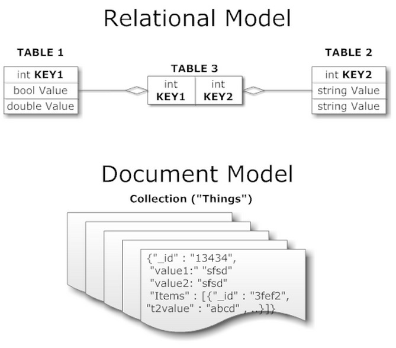
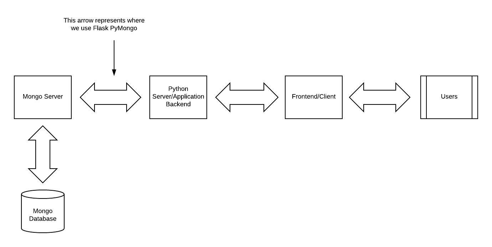

<!-- .slide: data-background="./header.svg" data-background-repeat="none" data-background-size="40% 40%" data-background-position="center 10%" class="header" -->
# Document-Based Databases

### [Slides](https://make-school-courses.github.io/BEW-1.1-RESTful-and-Resourceful-MVC-Architecture/Slides/08-Document-Based-Databases.html ':ignore')
### [Demo](https://github.com/Make-School-Courses/BEW-1.1-RESTful-and-Resourceful-MVC-Architecture/tree/master/Lessons/08-Document-Based-Databases/demo)

<!-- > -->


## Learning Outcomes

1. Identify the pros and cons of a NoSQL or Document-based database
1. Get comfortable with Mongo queries.
1. Understand how to connect and use MongoDB in a Python web app

<!-- > -->

# Document-Based Databases

<!-- v -->

## Overview

Document-Based Databases:

- Store data in **documents** similar to JSON
- Also called **NoSql** or **non-relational** because they don't use the more traditional, **relational** methods of storage

We'll go over the specifics of these **collections** in a bit.


<!-- v -->





<!-- v -->

## MongoDB

- Can have several **databases**. Use 1 database for 1 project.

- A database can have several **collections**. Each collection groups objects of the same type: User, BlogPost, Item, etc.
  - `User` resource would be stored in `users` collection
  - `BlogPost` resource would be stored in `blog_posts` collection

- Each collection supports **CRUD** operations

<!-- v -->

## What is CRUD?

- **C**reate, **R**ead, **U**pdate, **D**elete

- Represents the operations we can do on any one type of object

- Example - Users: Create a new user, show all users, update a user, delete a user

<!-- v -->

## Identifiers

MongoDB gives each document a unique identification number with the key `_id`. 

It's sort of like dropping clothes off at the dry-cleaners.


<!-- v -->

## Example

So, if we saved a new project like this to a MongoDB database:

```py
# PYTHON DICTIONARY OBJECT
{ "title": "A New Project" }
```

Then it will save something like this:

```js
// MongoDB OBJECT
{
  _id: "507f1f77bcf86cd799439011",
  title: "A New Project"
}
```

<!-- v -->

## Pros

1. Writes fast
2. More flexible and easy to start
3. "Schemaless" - can save anything you want regardless of datatype or schema

<!-- v -->

## Cons

1. Slow to traverse (search)
1. Slow to read from
1. "Schemaless" - can become unstructured

<!-- > -->

## Break [10 mins]
<!-- .slide: data-background="#087CB8" -->

<!-- > -->

# MongoDB Shell

<!-- v -->

## MongoDB Queries

[Mongo Shell Quick Reference](https://docs.mongodb.com/manual/reference/mongo-shell/)

MongoDB Shell is useful for:
- Quickly getting info from your database
- Addressing/debugging errors
- Inserting dummy data for testing your apps

<!-- v -->

## Getting Started

Install MongoDB:

```bash
$ brew tap mongodb/brew
$ brew install mongodb-community@4.2
$ sudo mkdir -p /data/db
$ sudo chown -R $USER /data/db
```

In a separate terminal, run:

```bash
$ mongod
```

Start the command-line interface:

```bash
$ mongo
```

<!-- v -->

## Create a Database

Switch to a database:

```bash
> use test
switched to db test
```

<!-- v -->


## Create

To create a new document in the collection `songs`:

```bash
> db.songs.insertOne({artist: "Journey", title: "Don't Stop Believin'"})
```

Try adding a few more on your own!

<!-- v -->

## Read

To view all documents in the collection `songs`:

```bash
> db.songs.find()
...
```

Or to view documents that satisfy a certain query, pass in some JSON:

```bash
> db.songs.find({artist: "Toto"})
{ "_id" : ObjectId("5d89999fb1db7e732ac60d78"), "artist" : "Toto", 
"song_name" : "Africa" }
```

<!-- v -->

## Update

We can update a single document:

```bash
> db.songs.updateOne({_id: ObjectId("5d89999fb1db7e732ac60d78")}, 
{$set: {song_name: "Rosanna"}})
```

Or update many at once:

```bash
> db.songs.updateMany({artist: "Toto"}, { $set: {rating: 5} })
```

<!-- v -->

## Delete

To delete a document:

```bash
> db.songs.deleteOne({song_title: "Rosanna"})
```

<!-- v -->


## Activity [10 mins]

Use the Mongo documentation and write the following queries in plain English. Find a partner and compare your answers.

```py
db.People.find().sort({ age: 1 }).limit(100)

db.Events.findOne({ name: "Burning Man" })

db.Cars.findById(request.args.carId)

db.Apps.findOne({ quality: "Great" }) # obviously won't return Snapchat or Lyft
db.Users.find({ age: {$gt: 18, $lt: 65 }})

db.Users.find({likes: {$in: ['chatting', 'candle making']}})
```

<!-- > -->

# Flask-PyMongo

<!-- v -->

## About Flask-PyMongo

[PyMongo](https://api.MongoDB.com/python/current/) is the lower level toolset (released by python) that you'll use to query the database for the stuff you want.  You can import this from Flask PyMongo.

[Flask-PyMongo](https://flask-pymongo.readthedocs.io/en/latest/) is a useful wrapper around PyMongo (and for your convenience comes packaged with PyMongo) that adds helper functions specifically for Flask.

<!-- v -->



<!-- v -->

## Using Flask-PyMongo

Let's import PyMongo:

```python
from flask_pymongo import PyMongo
```

And tell our Flask application where to find our database, with port `27017` (the default) and database name `test_db`.

```python
app.config["MONGO_URI"] = "mongodb://localhost:27017/test_db"
mongo = PyMongo(app)
```

<!-- v -->

## Writing a Route

Here is an example route to **read** all users:

```py
from bson.json_util import dumps

@app.route("/users")
def get_all_users(methods=["GET"]):
  users_list = db.users.find({}) # empty query returns all

  # returning the user list in JSON form
  return dumps(users_list)
```

<!-- v -->

## Activity

Copy the [demo code](https://github.com/Make-School-Courses/BEW-1.1-RESTful-and-Resourceful-MVC-Architecture/tree/master/Lessons/08-Document-Based-Databases/demo) and:

1. Test it out and see if you understand how it works
1. Add 2 new routes to **delete** a user:
  1. `delete_user_form` to display a form to enter a username
  1. `delete_user` to accept a POST request from the form and delete the user with specified username
1. Try the same for **update**!

<!-- > -->

## Announcements

- Playlister tutorial due Tues, Oct. 1 (in 1 week)
- Contractor project due Thurs, Oct. 10 (in 2.5 weeks) - take a look at the [Project Spec](https://docs.google.com/document/d/1C8eOyLBeGMKJ2y50QwLU5tWjNb2JVcpAE4khUBIfm0U/edit) before our next class

<!-- > -->

## Resources

- [Flask-PyMongo Tutorial](https://medium.com/@riken.mehta/full-stack-tutorial-flask-react-docker-ee316a46e876)