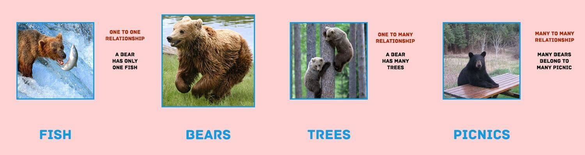

# ERDs, Resource Associations, & MongoDB

## Objectives

1. Master drawing a simple **Entity Relationship Diagrams** (ERDs) (2-5 resources)
1. Utilize the common verbiage for defining **Resource Associations**

## ERD Bears

Consider three resources: Fishes, Bears, Trees, and Picnics



1. Bears have many trees, trees belong to one bear
2. Bears have one fish, fish belongs to one bear
3. Bears have and belong to many picnics

## Associations (10 min)

There are three sorts of resource associations:

1. **One-to-Many** or *Has Many/Belongs To*
1. **One-to-One** or *Has One/Belongs To*
1. **Many-to-Many** or *Has And Belongs to Many*, or *Has Many Through*

### Examples

* **[Common] Facebook** - One to Many:
    * Users have many Posts
    * Users have many Comments
    * Users have many Likes

* **[Common] Eventbright** - Has and Belongs to Many:
    * Users have many Events as reservations
    * Users belong to many Events as guests

* **[Rare] Eventbright** - Has One/Belongs To
    * User has one Profile
    * User has one Credit Card

## Entity Relationship Diagrams — ERDs (5 min)

Before you code a project, it is good to spend about an hour completing three deliverables:

1. User Journeys (UX)
2. Wireframes (UI)
3. An Entity Relationship Diagram (Architecture)

These three will give you an baseline idea of the structure of your project before beginning. And they only take a few minutes to complete.

Let's look at how to draw ERDs.

Connect resources in boxes with arrows depending on their relationship:

1. Many-to-One: `=>`
1. Many-to-Many: `<=>`
1. One-to-Many: `-->`


## Activity - Drawing ERDs (15 min)

Draw ERDs for the core features of 3 the following applications. You can pick your own products if you like to draw. When you finish your first, check with a partner. Form into groups of 4 and show your favorites off.

1. Lyft
1. Pinterest
1. Airbnb
1. Facebook
1. Apple App Store

## Modeling Associations Using MongoDB (20 min)

In a document-based database these **Resource Associations** are modeled in a few ways. Here they are ordered by frequency

1. Reference Documents (very common)
2. Value Associations (pretty common)
3. Embedded Documents (very rare)

### Reference Documents (very common)

Very common for one-to-many and many-to-many associations.

#### Have Many/Belongs To

Users have many Posts, Posts belong to Users as "Author"

```py
from pprint import pprint


# First, find a specific User. Then print the titles of all Posts:
the_user = db.Users.find_one({"_id_": user_id})
for post in the_user.posts.find():
    pprint(post.title)

# Or, find all the posts written by this specific user.
db.Posts.find({"author": user_id})
```

The following BSON is returned after executing the code:

```json
// USER HAS MANY POSTS
{
  "name": "John Brown",
  "posts": ["a41492308329r900sdf", "9309safd0as0f9f098af"]
}

// POST BELONGS TO USER (AS AUTHOR)
{
  "title": "John Brown",
  "author": "asf675as6f6a4s6f"
}
```

#### Has and Belongs to Many

Users Have and Belong to Many Events as "Guests"

```py
# Add a user to represent a single Guest:
first_guest = {
  "name": "Dani",
  "rsvps": []
}

# Insert the new Guest:
first_guest_id = db.Guests.insert_one(guest).inserted_id

# Create a dictionary to represent a new Event.
# Add our first guest to the list of invitees:
new_event = {
  "title": "Burning Man",
  "description": "Hang out in the desert",
  "guests": [first_guest_id]
}

# Insert the Event object into the Events collection.
# Once added to the collection, we can store the saved Event ID for later use:
new_event_id = db.Events.insert_one(new_event).inserted_id

# Allow the first_guest to RSVP for the new_event:
db.Guests.find_one_and_update({'_id': first_guest_id}, {'$push': {'rsvps': new_event }})
```

#### Value Association (pretty common)

```json
{
  "title": "Mastering the Three Ball Cascade",
  "subreddit": "Jugglers Anonymous"
}
```

```py
# Return all Posts in a specific subreddit:
juggling_posts = db.Posts.find({subreddit: "Jugglers Anonymous"})
for post in juggling_posts:
    print(post.title)
```

```json
{
  "name": "John Brown",
  "city": "San Francisco"
}
```

```py
# Return all Users in a specific city:
sf_users = db.Users.find({"city": "San Francisco"})
for user in sf_users:
    print(user.name)
```

### Embedded Documents (very rare)

Rare for one-to-many associations.

Only use when you always want all children to appear with the parent.

Also if you don't want to edit the children very much or at all.

```py
embedded_post = {
  "title": "Awesome Article",
  "comments": [
    { "content": "What a great article" },
    { "content": "Agreed!" }
  ]
}

db.Posts.insert_one(embedded_post)
```

## Activity: Code Review (15 min)

Pair up and review one another's implementation of Playlistr.

Review code for:

1. Completeness
2. Variable naming
3. Spacing and Indentation
4. Modularity and file structure
5. Usability and style
