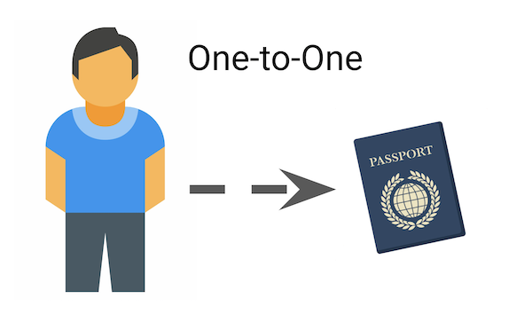
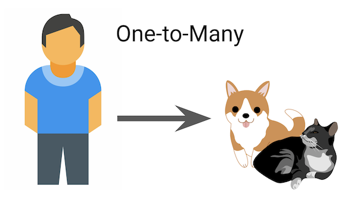

<!-- .slide: data-background="./header.svg" data-background-repeat="none" data-background-size="40% 40%" data-background-position="center 10%" class="header" -->
# ERDs, Resource Associations, & MongoDB

### [Slides](https://make-school-courses.github.io/BEW-1.1-RESTful-and-Resourceful-MVC-Architecture/Slides/09-ERDs-Resource-Associations-and-MongoDB.html ':ignore')
### [Demo](https://github.com/Make-School-Courses/BEW-1.1-RESTful-and-Resourceful-MVC-Architecture/tree/master/Lessons/09-ERDs-Resource-Associations-and-MongoDB/demo)

<!-- > -->

## Objectives

1. Master drawing a simple **Entity Relationship Diagrams** (ERDs) (2-5 resources)
1. Utilize the common verbiage for defining **Resource Associations**

<!-- > -->

# Resource Associations

<!-- v -->

## Types of Associations

There are three sorts of resource associations:

1. **One-to-Many** or *Has Many/Belongs To*
1. **One-to-One** or *Has One/Belongs To*
1. **Many-to-Many** or *Has And Belongs to Many*, or *Has Many Through*

<!-- v -->

## One-to-One

A **person** has _exactly_ one **passport**. (A passport belongs to one person.)



<!-- v -->

## One-to-Many

A **person** _has many_ **pets**. (A pet belongs to exactly one person.)



<!-- v -->

## Many-to-Many

A **person** _can attend many_ **picnics**, and many people can attend one picnic.


<!-- v -->

## Examples

<div class="compact">

* **[Common] Facebook** - One to Many:
    * Users have many Posts
    * Users have many Comments
    * Users have many Likes

* **[Common] Eventbright** - Has and Belongs to Many:
    * Users have many Events as reservations
    * Users belong to many Events as guests

* **[Rare] Eventbright** - Has One/Belongs To
    * User has one Profile
    * User has one Credit Card
</div>

<!-- v -->

## Entity Relationship Diagrams — ERDs

Before you code a project, it's a good idea to spend some time thinking about the relationships between objects.

Connect resources in boxes with arrows depending on their relationship:

1. Many-to-One: `=>`
1. Many-to-Many: `<=>`
1. One-to-Many: `-->`

<!-- v -->


<!-- v -->


<!-- v -->

## Activity - Drawing ERDs [15 min]

Draw ERDs for the core features of 3 the following applications. When you finish each one, check with a partner. Form into groups of 4 and show your favorites off.

1. Lyft
1. Pinterest
1. Airbnb
1. Facebook
1. Apple App Store

<!-- > -->


## Break [10 mins]
<!-- .slide: data-background="#087CB8" -->

<!-- > -->

# Modeling Associations

<!-- v -->

## Modeling Associations Using MongoDB

In a document-based database these **Resource Associations** are modeled in a few ways. Here they are ordered by frequency

1. Reference Documents (very common)
2. Value Associations (pretty common)
3. Embedded Documents (very rare)

<!-- v -->

## Reference Documents

In this case, each **document** (e.g. user or post) contains a reference to the **_id** field of the documents it's related to.

```py
# User has many posts
{
  "name": "Jamar Brown",
  "posts": ["a41492308329r900sdf", "9309safd0as0f9f098af"]
}

# Post belongs to user (as author)
{
  "title": "Understanding Model View Controller",
  "author": "asf675as6f6a4s6f"
}
```

<!-- v -->

## Value Association

In this case, a document contains a reference to the **value** (usually a name or ID code) of its related documents. The document for a Reddit post might look like this:

```json
{
  "title": "Mastering the Three Ball Cascade",
  "subreddit": "Jugglers Anonymous"
}
```

And we can find all posts in a subreddit like this:

```py
# Return all Posts in a specific subreddit:
juggling_posts = db.Posts.find({subreddit: "Jugglers Anonymous"})
for post in juggling_posts:
    print(post.title)
```

<!-- v -->

## Embedded Documents

Rare for one-to-many associations.

Only use when you always want all children to appear with the parent, or if you don't want to edit the children very much or at all.

```py
embedded_post = {
  "title": "Awesome Article",
  "comments": [
    { "content": "What a great article" },
    { "content": "Agreed!" }
  ]
}

db.Posts.insert_one(embedded_post)
```

<!-- v -->

## Activity

Choose one of your resource diagrams and decide whether to model the associations as a **Reference to Document**, **Value Association**, or **Embedded Document**. What are the pros and cons of each?

<!-- > -->

## Announcements

- Playlister tutorial due on Tuesday, Oct 1 - Let Meredith know of any errors

- [Contractor Project](https://docs.google.com/document/d/1C8eOyLBeGMKJ2y50QwLU5tWjNb2JVcpAE4khUBIfm0U/edit) due on Thursday, Oct 10

<!-- > -->

## Resources

- [Mongo Shell Quick Reference](https://docs.mongodb.com/manual/reference/mongo-shell/)
- [Mongo Shell Manual](https://docs.mongodb.com/manual/mongo/)
- [PyMongo Documentation](https://api.mongodb.com/python/current/)
- [Flask-PyMongo Documentation](https://flask-pymongo.readthedocs.io/en/latest/)