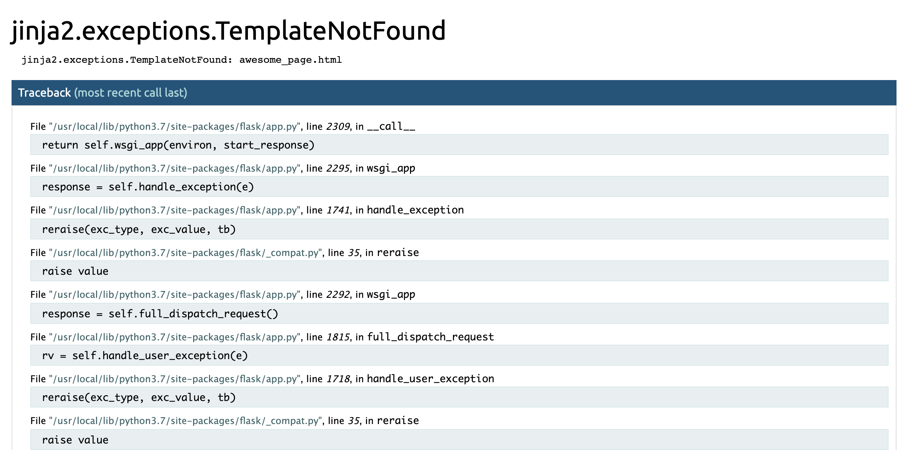

<!-- .slide: data-background="./header.svg" data-background-repeat="none" data-background-size="40% 40%" data-background-position="center 10%" class="header" -->
# Project Planning & User-Centered Development

### [Slides](https://make-school-courses.github.io/BEW-1.1-RESTful-and-Resourceful-MVC-Architecture/Slides/10-Project-Planning-and-User-Centered-Development.html ':ignore')
### [Demo](https://github.com/meredithcat/Candies-App-Contractor-Project)

<!-- > -->

## Objectives

1. Describe the process of User-Centered Development
1. Create wireframes, user stories, & an ERD for your app
1. Compare and contrast GET and POST methods
1. Write routes & templates corresponding to pages in your app

<!-- > -->

# How to Plan a Project

<!-- v -->

## Wireframes

Wireframes are rough sketches of what you want your web pages to look like.

Take a look at this [example](assets/wireframe_example.png).

<!-- v -->

## User Stories

A User Story is a description of how a user interacts with your app and what benefit they get from doing so.

"As a user, I want to *function* so that *benefit*"

*e.g. "As a user, I want to **buy fruits** so that I can **send a nice gift** to my best friend."*

<!-- v -->

## Entity Relationship Diagrams

An **Entity Relationship Diagram** (or ERD) shows the relationships between the resources used on your site.

Reminder that a **resource** is any entity you want to store in your database! E.g. for a shoe selling site, the resources might be *users*, *shoes*, and *shopping carts*.

<!-- v -->

## Activity [30 mins]

Fill out the worksheet for *your specific project*:

- Wireframes
- User Stories
- Entity Relationship Diagram

Once you finish each part, find a reviewer to look over your work and give feedback. ***Each part of the worksheet must be reviewed by a different person!***

<!-- > -->

## Break [10 mins]
<!-- .slide: data-background="#087CB8" -->

<!-- > -->

# HTTP Methods

<!-- v -->

## What are HTTP Methods?

HTTP Methods correspond roughly to the CRUD operations we've studied previously. They are as follows:

| HTTP Verb      | CRUD Operation |
| ----------- | ----------- |
| POST      | Create       |
| GET   | Read        |
| PUT/PATCH   | Update |
| DELETE | Delete |

<!-- v -->

## What about form methods?

<div class="compact">

An HTML form can only have one of two methods: **GET** or **POST**.

- <span class="greentext">GET</span> is used when we are only reading (and not changing) data. Example: A search bar that filters search results

- <span class="redtext">POST</span> is used when we are changing (creating, updating, deleting) data.

</div>

| HTTP Verb      | CRUD Operation | Form Method |
| ----------- | ----------- | -------------- |
| POST      | Create       | <span class="redtext">POST</span> |
| GET   | Read        | <span class="greentext">GET</span> |
| PUT/PATCH   | Update | <span class="redtext">POST</span> |
| DELETE | Delete | <span class="redtext">POST</span> |

<!-- v -->

## Example: GET

If our HTML form looks like this:

```html
<form action="/" method="GET">
    Type in your city:
    <input type="text" name="city">
    <button type="submit">Submit!</button>
</form>
```

Then your route will look like this:

```py
@app.route('/', methods=['GET'])
def home_page():
    city_name = request.args.get('city')
    ...
```

<!-- v -->

## Example: POST

If our HTML form looks like this:

```html
<form action="/" method="POST">
    Type in your username:
    <input type="text" name="username">
    <button type="submit">Submit!</button>
</form>
```

Then your route will look like this:

```py
@app.route('/', methods=['POST'])
def home_page():
    username = request.form.get('username')
    ...
```

<!-- > -->

# More Project Tips

<!-- v -->

## Workflow

What should I write first? Here's a rough list.

1. Choose a page from your wireframes to start with.
<!-- .element: class="fragment" -->
1. Write a route to correspond to that page.
<!-- .element: class="fragment" -->
1. Write a template for the page.
<!-- .element: class="fragment" -->
1. Repeat from step 1.
<!-- .element: class="fragment" -->

<!-- v -->

## Reminder: Errors = Signposts!

If you encounter an error, *it is telling you what to do next!*



<!-- v -->

## Example App

Explore this [example app](https://candies-app-mm.herokuapp.com/) and its [source code](https://github.com/meredithcat/Candies-App-Contractor-Project).

<!-- > -->

## Announcements

Playlister tutorial is due **today** by 11:59pm! Add your repository link to the [Progress Tracker](https://make.sc/bew1.1-tracker).

Contractor project is due on **Thursday, October 10** at 11:59pm.

<!-- > -->

## Resources

- [Flask Tutorial](https://pythonspot.com/flask-web-app-with-python/)
- [PyMongo Tutorial](https://api.mongodb.com/python/current/tutorial.html)
- [More on User-Centered Design](https://www.interaction-design.org/literature/topics/user-centered-design)
- [What is an MVP?](https://www.agilealliance.org/glossary/mvp/)
