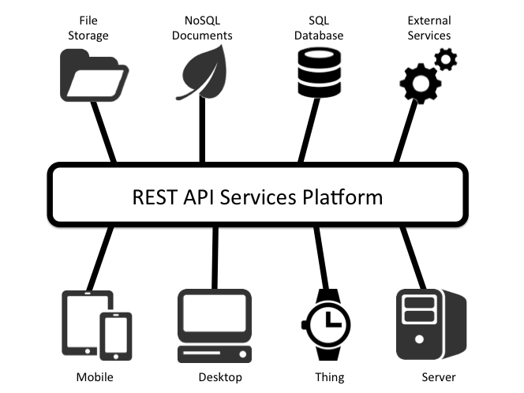
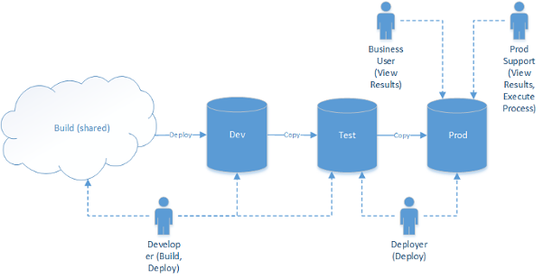
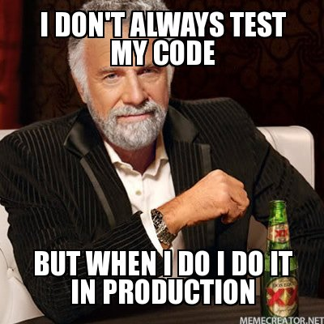

# RESTful APIs & Deployment Environments

## Objectives (5 min)

1. Create routes that respond to a request for JSON data.
2. Define a strategy for configuring your development and production environment.
3. Protect private keys and other development secrets using `dotenv`.

## Activity - Explore Service Oriented Architecture (10 min)

With a partner pick 2 companies on [stackshare.io](https://stackshare.io/stacks) and examine the services and languages they use. Google the services you are not familiar with.

## Overview

### RESTful APIs

So far we've been making User Interfaces (UIs) by returning HTML templates to the client, but what if we want to let other applications use our web server, such as a mobile app client, a desktop client, a front end framework, or another web server? In that case we want to make an API.



An API is a set of web endpoints that respond to JSON (or XML) rather than with HTML templates.

Basically, UIs are how people use your website, while APIs are how other computers use your code.

We've already used APIs --- like those found at [RapidAPI.com](https://rapidapi.com/) --- but now we want to make our own.

To build a server that hosts a RESTful API, we need our server to respond intelligently to JSON requests.

Since we already have RESTful routes that return HTML, we have two options: either we can make separate whole controllers, or we can check if the request coming in has the `Content-Type` header of `application/json`. Then, our server can respond accordingly.

#### Same Controllers

<!-- TODO: Rewrite in Flask. -->
```
controllers
  - posts.js
  - comments.js
```

#### Separate Controllers

<!-- TODO: Rewrite in Flask. -->

```
controllers
  api
    - posts.js
    - comments.js
  - posts.js
  - comments.js
```

#### Versioned API

<!-- TODO: Rewrite in Flask. -->

```
controllers
  api
    v1
      - posts.js
      - comments.js
    v2
      - posts.js
      - comments.js
  - posts.js
  - comments.js
```

#### Same Controllers - Respond to `application/json`

<!-- TODO: Rewrite in Flask. -->

```js
app.get('/posts', function(req, res){

  ...

  //=> RETURN JSON
  if (req.header('Content-Type') == 'application/json') { return res.send({ post: post }); }

  //=> RETURN HTML
  return res.render('posts-show', { post: post }); //=> RENDER A TEMPLATE
});
```


#### New API controller routes

<!-- TODO: Rewrite in Flask. -->

```js
// API ROUTES

// INDEX
app.get('/api/posts', function(req, res){

});

// SHOW
app.get('/api/posts/:id', function(req, res){

});

```

```js
// VERSIONED API ROUTES

// INDEX
app.get('/api/v1/posts', function(req, res){

});

// SHOW
app.get('/api/v1/posts/:id', function(req, res){

});

// ETC
```

> Notice that the NEW and EDIT routes are not necessary with a RESTful API.

## Activity: Make Rotten Potatoes Respond to JSON - 30 min

1. Download [Insomnia RESTful API Client](https://insomnia.rest/)
2. Use it to make a request to your "/" route. You should see the HTML that returns to any browser.
3. Now update your root route '/' logic to respond with JSON `reviews` if the `Content-Type` is `application/json`.
4. In your headers in Insomnia add `"Content-Type" "application/json"` and make a request to `/`. You should see JSON returned.
1. Now make the same change to the rest of your Review routes.

## A Traditional Workflow for Release

Any software project has at a few separate **Environments**. Currently we are just using 2 - DEV & PROD.

- **Development (DEV)** on local machines
- **Test (TEST)** on local machines or a separate test server
- **Staging (STAGING)** on a production server (private for stabilization and load testing)
- **Production (PROD)** on a production server




Your computer is the host for your development environment.

Heroku will be the host we use for our Production environment. Heroku is a simple turn-key server solution that is free (but requires a credit card).

Heroku also provides a rich marketplace of plugins to extend and enhance your server such as monitor bugs, speed, and add databases.

Additionally, we'll be using the "mLabs" plugin to add a production MongoDB database to our project.

These environments can vary slightly. Some common differences between `dev` and `prod` include:
  - Different information in the `dev` database versus `prod`.
  - Production assets are typically minified or compiled
  - Environment variables or `dotenv` settings always differ between environments

As developers, it's prudent to keep these environments as similar to each other as possible. Even slight differences can cause a failure in production --- _even if it worked perfectly in development!_



## Environment Variables in `process.env`

<!-- TODO: Rewrite for python-dotenv -->

Sometimes you can't save everything into your code files because that would be insecure. For example, if you use a third party service like Amazon Web Services (AWS), then there will be sensitive keys that if you expose to the world on a public Github repo, hackers will steal them and use your codes to rack up hundreds of dollars in fees.

To secure such data, developers use encrypted environment variables that they store locally and in production.

The node package people use to define these variables is called [`dotenv`](https://www.npmjs.com/package/dotenv).

## Activity: Protect your Tenor API Key

1. Add the `python-dotenv` package to your Gif Search project:

```bash
$ pip3 install python-dotenv
```

1. Add a `.env` file with the following file:

   ```bash
   TENOR_API_KEY=yourapikeyvalue
   ```

1. Add the following code **at the very top** of your `app.py` file in order to use `.env` variables in Python:

   ```py
   import os

   from dotenv import load_dotenv
   load_dotenv()
   ```

1. Any variables you defined in the `.env` file can now be accessed via Python's `os.getenv()` function:

  ```py
    import os

    from dotenv import load_dotenv
    load_dotenv()

    TENOR_API_KEY = os.getenv("TENOR_API_KEY")
  ```

## Activity: Gif Search Going Live (15 min)

1. Execute `heroku create <<PROJECT NAME>>` to create a heroku project for your Gif Search app.

2. Push your code to heroku and run `heroku open` to open your project. _(It shouldn't work --- yet!)_

3. Run `heroku logs --tail` and read the logs to see why your deployment didn't go as planned.
    - What error did you receive? What do you think could be missing?
    - We haven't told Heroku about our `dotenv` settings!

4. Run the following commands to populate your `.env` variables in your current Heroku instance:

    ```bash
    $ heroku config:set FLASK_APP=app.py
    Setting FLASK_APP and restarting flask-gifsearch... done, v2

    $ heroku config:set TENOR_API_KEY=yourapikeyvalue
    Setting TENOR_API_KEY and restarting flask-gifsearch... done, v3
    ```

5. Run `heroku open` one more time, and ensure the above commands fixed the bug found in the logs.

6. Celebrate your very first push to production by sharing the link to your  Gif Search project in BEW 1.1 Tracker.

## Homework: TODO

Find an alternative to the Getting Started with Node.js on Heroku tutorial.
