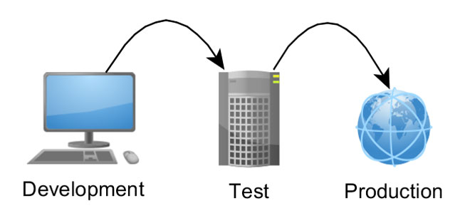

<!-- .slide: data-background="./header.svg" data-background-repeat="none" data-background-size="40% 40%" data-background-position="center 10%" class="header" -->
# RESTful APIs & Deployment Environments

➡️ [**Slides**](https://make-school-courses.github.io/BEW-1.1-RESTful-and-Resourceful-MVC-Architecture/Slides/11-RESTful-APIs-and-Deployment-Environments.html ':ignore')

<!-- > -->

## Objectives (5 min)

By the end of this class, you will be able to...

1. Define a strategy for configuring your development and production environment.
2. Protect private keys and other development secrets using `dotenv`.
3. Practice deploying several applications to Heroku.

<!-- > -->

## Why Should I Learn This?

<!-- > -->

## A Traditional Workflow for Release

Any software project has at a few separate **Environments**:

- **Development (`DEV`)** on local machines
- **Staging (`STAGING`)** on a production server (private for stabilization and load testing)
- **Production (`PROD`)** on a production server




Your computer is the host for your development environment.

Heroku will be the host we use for our Production environment. Heroku is a simple turn-key server solution that is free (but requires a credit card).

Heroku also provides a rich marketplace of plugins to extend and enhance your server such as monitor bugs, speed, and add databases.

Additionally, we'll be using the "mLabs" plugin to add a production MongoDB database to our project.

These environments can vary slightly. Some common differences between `dev` and `prod` include:
  - Different information in the `dev` database versus `production`.
  - Production assets are typically minified or compiled
  - Environment variables or `dotenv` settings always differ between environments

As developers, it's prudent to keep these environments as similar to each other as possible. Even slight differences can cause a failure in production --- _even if it worked perfectly in development!_

<p align="center">

## Environment Variables

### Meet `.env`

Sometimes you can't save everything into your code files because that would be insecure. For example, if you use a third party service like Amazon Web Services (AWS), then there will be sensitive keys that if you expose to the world on a public Github repo, hackers will steal them and use your codes to rack up hundreds of dollars in fees.

To secure such data, developers use encrypted environment variables that they store locally and in production.

The `pip` package used to define these variables is called [`python-dotenv`](https://github.com/theskumar/python-dotenv).

## Activity: Protect your Tenor API Key

1. Add the `python-dotenv` package to your Gif Search project:

```bash
$ pip3 install python-dotenv
```

1. Add a `.env` file with the following file:

   ```bash
   TENOR_API_KEY=yourapikeyvalue
   ```

1. Add the following code **at the very top** of your `app.py` file in order to use `.env` variables in Python:

   ```py
   import os

   from dotenv import load_dotenv
   load_dotenv()
   ```

1. Any variables you defined in the `.env` file can now be accessed via Python's `os.getenv()` function:

  ```py
    import os

    from dotenv import load_dotenv
    load_dotenv()

    TENOR_API_KEY = os.getenv("TENOR_API_KEY")
  ```

## Activity (15 min)

### Going Live with Gif Search

1. Execute `heroku create <<PROJECT NAME>>` to create a heroku project for your Gif Search app.

2. Push your code to heroku and run `heroku open` to open your project. _(It shouldn't work --- yet!)_

3. Run `heroku logs --tail` and read the logs to see why your deployment didn't go as planned.
    - What error did you receive? What do you think could be missing?
    - We haven't told Heroku about our `dotenv` settings!

4. Run the following commands to populate your `.env` variables in your current Heroku instance:

    ```bash
    $ heroku config:set FLASK_APP=app.py
    Setting FLASK_APP and restarting flask-gifsearch... done, v2

    $ heroku config:set TENOR_API_KEY=yourapikeyvalue
    Setting TENOR_API_KEY and restarting flask-gifsearch... done, v3
    ```

5. Run `heroku open` one more time, and ensure the above commands fixed the bug found in the logs.

6. Celebrate your very first push to production by sharing the link to your Gif Search project in [BEW 1.1 Tracker](make.sc/trackbew1.1).
